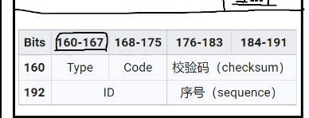

#大喵培训笔记

##  4/29
    css 最少200行  js最少100行
	marjin heverbeke  a modern intro to programming
	
	操作
	    shift+右键
	win
	    path
	快捷键
	    hoekey   autohotkey
	软件
	    everything 
		strokeit
	
	chrome.exe --proxy-pac-url=https://cddm.me/ac.js
--------------------------------------------------
##  4/30
    对数   三角函数  线性/非线性  
	内核   webkit   gecko
	聊聊折腾的重要性
	www.canluse.com
	
	8bit=1byte  24bit=3个字节(byte) 每一bit 可以代表0 或 1 的数位讯号
	
	照片
	    jpg-jpeg
		    有损压缩
		png
		    无损压缩
			支持透明色
		gif
		    无损（原始图片颜色数量不足256色）
			抽烟出256种颜色
			支持透明，只有两种，一种完全不透明，要么完全透明
		bmp
		    无压缩
			每个点3个字节  (取决于 24/位   单色/1bit  256色/8bit)
		webp
		    google发明
			有损压缩
			各方面都胜过jpg适合移动端使用
			支持alpha通道
	
	ASCII
	    0=48  1=49   10和13  A=65   a=97  空格=
	Unicode
	    编号
		UFT-8编码方式
	GUI   图形化  用户界面接口
	CLI    命令行
	    GUI和CLI不同在于形式不一样
	API   应用编程接口
	技能树
	
### linux
	    cgywin
		mingw 
		wsl windos subsy for linux
	命令行
	    当前工作目录    
		裸命令
		    pwd显示出当前目录的绝对路径
		    ls  当前目录的列表   ls --all  全部的文件
			   ls -l长列表输出形式
			   ls -lah  所有文件长列表形式
	        touch   创建文档
		    cd  change dir  切换路径
			print
			clear
			working
			diretory
			cd /home 进入 '/ home' 目录' 
			cd .. 返回上一级目录 
			cd ../.. 返回上两级目录 
			cd 进入个人的主目录 
			cd ~user1 进入个人的主目录 
			cd - 返回上次所在的目录 
			pwd 显示工作路径 
			ls 查看目录中的文件 
			ls -F 查看目录中的文件 
			ls -l 显示文件和目录的详细资料 
			ls -a 显示隐藏文件 
			ls *[0-9]* 显示包含数字的文件名和目录名 
			tree 显示文件和目录由根目录开始的树形结构(1) 
			lstree 显示文件和目录由根目录开始的树形结构(2) 
			mkdir dir1 创建一个叫做 'dir1' 的目录' 
			mkdir dir1 dir2 同时创建两个目录 
			mkdir -p /tmp/dir1/dir2 创建一个目录树 
			rm -f file1 删除一个叫做 'file1' 的文件' 
			rmdir dir1 删除一个叫做 'dir1' 的目录' 
			rm -rf dir1 删除一个叫做 'dir1' 的目录并同时删除其内容 
			rm -rf dir1 dir2 同时删除两个目录及它们的内容 
			mv dir1 new_dir 重命名/移动 一个目录 
			cp file1 file2 复制一个文件 
			cp dir/* . 复制一个目录下的所有文件到当前工作目录 
			cp -a /tmp/dir1 . 复制一个目录到当前工作目录 
			cp -a dir1 dir2 复制一个目录 
			ln -s file1 lnk1 创建一个指向文件或目录的软链接 
			ln file1 lnk1 创建一个指向文件或目录的物理链接 
			touch -t 0712250000 file1 修改一个文件或目录的时间戳 - (YYMMDDhhmm) 
			file file1 outputs the mime type of the file as text 
			iconv -l 列出已知的编码 
			iconv -f fromEncoding -t toEncoding inputFile > outputFile creates a new from the given input file by assuming it is encoded in fromEncoding and converting it to toEncoding. 
			find . -maxdepth 1 -name *.jpg -print -exec convert "{}" -resize 80x60 "thumbs/{}" \; batch resize files in the current directory and send them to a thumbnails directory (requires convert from Imagemagick) 

			文件搜索 
			find / -name file1 从 '/' 开始进入根文件系统搜索文件和目录 
			find / -user user1 搜索属于用户 'user1' 的文件和目录 
			find /home/user1 -name \*.bin 在目录 '/ home/user1' 中搜索带有'.bin' 结尾的文件 
			find /usr/bin -type f -atime +100 搜索在过去100天内未被使用过的执行文件 
			find /usr/bin -type f -mtime -10 搜索在10天内被创建或者修改过的文件 
			find / -name \*.rpm -exec chmod 755 '{}' \; 搜索以 '.rpm' 结尾的文件并定义其权限 
			find / -xdev -name \*.rpm 搜索以 '.rpm' 结尾的文件，忽略光驱、捷盘等可移动设备 
			locate \*.ps 寻找以 '.ps' 结尾的文件 - 先运行 'updatedb' 命令 
			whereis halt 显示一个二进制文件、源码或man的位置 
			which halt 显示一个二进制文件或可执行文件的完整路径 
	
		带参数
		    ls --help 命令帮助
		管道  |
		PM2 -h 
		
		ctrl+c  结束
		
        路径    which+命令
    命令格式
	    命令名+参数
		在windows的wsl中也可以，安装好wsl后执行以下命令：
		sudo apt install fortune
		sudo apt install cowsay
		sudo apt install lolcat
		后也可以
--------------------------------------------------
##  5/1
    相对路径
        ../ 代表一级上级目录(间隔一个目录)
        <a href="first/2.html">链接到下级目录(first)中的文件</a>


    
	命令
	    cat 查看文件内容
		echo  打印东西  命令行脚本文件
		cd  相对路径 
		
		sudo  super user do
		rm -rf dir1 删除一个叫做 'dir1' 的目录并同时删除其内容 
		rm -rf dir1 dir2 同时删除两个目录及它们的内容 
		rmdir   删除空文件
		rm   只能删文件，不能删文件夹
		mkdir dir1 创建一个叫做 'dir1' 的目录
		mkdir -p /tmp/dir1/dir2 创建一个目录树 
		mv  移动(重命令)
		cal 日历  cal --help
		cmt
		mc  图形界面
		apt update
		vi  编辑器  查看模式   I 编辑模式 ：w  保存  ：wq  保存并退出
		vimtutor  教程
		nano
		mc  mcedit
--------------------------------------------------
## 5/2  markdown
	markdown语法
	*有序
	**粗体
	``代码  4个空格
	```css  有高亮  不用空格
	
	sublime命令窗口  ctrl+s+p 
		ctrl+p

	## 多行快捷键
		ctrl+D  多选
		ctrl+s+l  
		

	##HTML
	自闭和标签
	a标签
		<a href="#">特定位置
	p tag    develop
	alt   替补选项  
	input  表单元素用name
	alternative  可选项
	alternate
	alter 修改
	source
	class属性
	comma separatad list
	tabindex  可以控制tab建的  用在可交互元素
	data-   杜撰的属性加
	转义符
	&；  &=amp
	&nbsp  160号空格
	html ent（实体）w3
	
	csszzengarden
--------------------------------------------------
	
## 5/3  git
	head
		页面编码方式   charset
		页面图标  link   rel属性  /favicon，ico
		base   基准  href   target属性 _blank  新窗口  _self  不是新窗口
		meta   refresh刷新  
				http-equiv=“refresh”  content=“1”				bash
					先用git bash打开
					browser-sync start --server --directory --files "*"
					保存后刷新

### git
	1.git add .
	2.git commit -m ""
	git remote  add origin ssh://root@添加远程仓库路径
	git push
	git pull 合并
	git status   状态
	git diff    版本之间的差异
	git checkout master  回到之前版本
	
	git log  提交日志  (https://github.com/robin191/learn-git)
	git clone  克隆仓库
	

##  5/6  html
	
	pre  内容的空格和回车都都会保留
			可以和<code>一起用
	obs
	
	marquee   已经不再用  滚动 
	em  语义为强调，为斜体
	
	可访问性 accessibility   a11y  internationalizition  i18n
              * 读屏软件
              * windows 高比对度主题
              * a r i a/role
			  * accessibly rich internet application
			  * 网页应用程序
			  * role属性提示浏览器当前元素是一个何种视觉元素 比如菜单  导航条 内容等
			  * aria-xxx=yyy提示浏览器当前视觉元素的状态或其他信息
	
	form  表单
		input
			type属性
				text
				password
				checkbox  多选
				radio  单选
			* file
                - accept
                + 可以接受的文件类型
                + `<input type="file" name="" id="" accept="image/*,text/*">`
               * MIME Type
                + `<input type="file" name="" id="" accept=".jpg,.png,.gif,.jpeg,.webp,.exe" 					value="c:/user/xieran/desktop/a.pdf">`
                * http://wwww.a.com/favicon.ico
                - 安全问题
                - multiple
                    + 是否支持多选文件
                    * hidden
                        - 隐藏的输入域
                        - value设置其值
                        - name设置名字
                    * 为以下三个值时，都表现为按钮的样式，按钮上的文字需要用value属性来设置
                    * image
                        - 此时需要使用src属性指定图片的地址
                        - 现在基本上不这么用，之所以有这个用法，是以前不用js时想做出漂亮的按钮时，								需要这么用
                        - 在html5中，可以在这种标签上给定width跟height，类似img标签相应的属性，src，alt
			 disabled
                     + 无值的属性
                 	 + 禁用这个输入域	
		    required
                   + 设置这个输入域为必填项
                   + 不填的话无法用**正常手段**触发表单提交
			placeholder
                    + 占位符
                    + 提示性文字，一旦输入内容就消失
			autofocus
                            + 自动获得焦点，即页面加载完                 后光标自动在这个元素内

	button
		type
			* 不写type属性的话，默认为submit
                - 即：无type的button的type		属性默认为submit
                * `<button type="reset/button/submit">Submit</button>
			* button
                - 常规按钮，功能上与input[type="button"]一样
                * submit
                - 提交按钮，功能上与input[type="submit"]一样
                * reset
                - 重置按钮，功能上与input[type="reset"]一样
			与`<input type="button" name="b" value="lksjdf">`的区别
                * input的button只能在按钮上显示纯文字
                * 而button标签可以在按钮上显示其它内容比如图片（即嵌套其它标签），文字也可以设置不同颜色等	
			label 标签
                    + 一般与checkbox及radio一起用，以扩大这两个按钮的可点击区域，提升用户体验。当然，也可以跟其它元素一起用，不过一般没必要（比较典型的是与input:file一起用）
                    - for属性
                        + 为 想要被扩大点击区域的元素的id，不带井号
                        - 支持度非常好，ie5都支持
                        - 细节：在ie8及以下不能用于displaynone的表单元素，可能是因为 not focusable
                        - 表单元素嵌套在label的时候可以不用for属性
                          ```html
                          <form action="">
                            有for的用法
                            <label for="oneid">One</label>

                            <input onclick type="text" id="oneid">

                            不用for的用法
                            <label>
                              <input type="checkbox"> 男
                            </label>
                          </form>
                          ```
                    - 如下怎么算呢？
                      ```html
                      <input id="a">
                      <label for="a">
                        <input type="text">
                      </label>
                      ```

                    - 典型的坑，两次点击，等学了js后再谈
                - select name="sel"
                    + 下拉选择框
                    + 属性
                        * multiple
                            - 无值属性，表示多选，多选时就不是下拉的样式了
                    + 另外此标签在不同的系统里面样式差别很大，而且它的样式一般来说是取自系统自带的，所以很难被css控制
                        * 所以一些对ui要求比较高的网站都选择用其它元素模拟下拉框
                            - 例：小米路由器
                * option
                    * value
                        - 选择了该项目后它所属的select元素的值
                    * selected
                        - 默认被选中
                    * disabled
                        - 表示该项被禁用
                    * hidden
                        - 表示该项被隐藏
                    - 以上三个属性均无值
                * optgroup // hgroup  colgroup
                    - 给option分组
                    - 用label属性表示这个分组的名字
                    - 无法被选中，只能选择option
                    - 有一个disabled属性，如果设置了这个属性，整组标签都会被禁用
                    ```html
                    <select>
                        <option value="1">1</option>
                        <optgroup label="这是一个分组" disabled hidden>
                            <option value="01">01</option>
                            <option value="02">02</option>
                            <option value="03">03</option>
                            <option value="04">04</option>
                            <option value="05">05</option>
                        </optgroup>
                    </select>
                    ```
                    - 兼容性不确定，因为我没用过mac。。。。
                - textarea
                    + 多行文本输入框
                    + 两个特殊属性
                        * rows="3"
                        * cols="20"
                    + 不过现在也不常用，一般都用css来控制了
                - field set 字段组 用来把 一组 输入域 放在一起的。
                    + field就是字段的意思，就是说一个表单输入域（输入框）
                    + 这个标签用来给输入域分组，所以叫set
                        * set本来就是组的意思
                    + 如果只是分组，完全可以用div等标签
                        * 那这个标签有什么用呢？
                        * fieldset有个disabled属性，如果它有了这个属性，其内的所有输入域都将被禁							用，类似optgroup
                            - 在某些场景下是非常好用的
                - legend
                    + 只能作为 fieldset 的子元素，用来标识这组输入域的名字，基本上没有其它用处
                        * 而且在有了css之后，这个标签基本也没有用武之地了

			
	MIME Type 媒体类型
	jpg  image/jpg
	png  image/png
	gif  image/gif
	
	html  text/html
	css   text/css
	js    application/javascript
	
	multpile 多选
	
	selected  不被选择
--------------------------------------------------
		
##  5/7
	table
		这个标签以前经常用于做布局
        + 什么是布局？即页面大区块的排列和摆放
        + 为什么呢？因为table都是方方正正格子，了解后很容易控制
            * 语义很差
            * 可读性很差
            * 可维护性也很差 maintainable
            * 可访问性
        + 但现在有了 css 之后，基本上只用table来显示数据，即表格本来的作用
        + 熟悉 DIV+CSS 布局 JD Job Description
    * caption
        - 表格标题
    * thead
        - 表头
        - 做为table的直接子元素
        - 只能有一个
        - 只有一个的情况下，即使出现在tbody的后面，其内容也会显示在tbody的前面
        - 非要写多个的话，第一个以外的会当做tbody来处理
    * tbody
        - 表格主体
        - 做为table的直接子元素
        - 可以有多个
    * tfoot
        - 表尾
        - 做为table的直接子元素
        - 只能有一个
        - 只有一个的情况即使出现在tbody的前面面，它的行也出现在tbody的后面
        - 非要写多个的话，第一个以外的会当做tbody来处理
    * tr
        - table row cell
        - 表格行
        - 可以直接做为table的子元素，会被放入创建的tbody里面
        - 或者做为上面三个标签(thead/tbody/tfoot)的子元素
    * th
        - table header cell
        - 用在表头单元格
        - 文字默认为加粗
        - id用于被td元素引用以表示td所属的标题是哪一个
            + 看例子
    * td
        - table data，表格数据单元格
        - headers
            + 表格头，值为某th的id，以表示这个数据的名称
                * 方便读屏软件
            + headers的值可以是多个以空格分隔的th的id的值，用法可能是th或td单元格跨行或跨列了
		col 列   
		colgroup  <colgroup bgcolor=>
					<col
					<col
					<col bgcolor>
				  <colgroup bgcolor=>
		colspan  跨行
		rowspan  跨列
		
		
		* map
    - 不是“地图”标签，是“映射”标签
    - name属性
    - 如果设置id属性的话，id跟name属性值必须一样
        * <input type="radio" name="a" id="a1">
          <input type="radio" name="a" id="a2">
          <input type="radio" name="a" id="a3">
          <input type="radio" name="a" id="a4">
          <input type="radio" name="a" id="a5">
    * area
    - 必须做为map的子元素
    - w3school上的错误示范：http://www.w3school.com.cn/tags/att_img_usemap.asp
    - 属性
        + href
        + target
        + alt
        + 以上三个属性同a标签
        + shape
            * rect(angle)，矩形
                - x1,y1,x2,y2
            * circle，圆形
                - cx,cy,r
                - 圆心x，圆心y
                - 半径r
            * poly(gon)，多边形
                - 至少6个值，表示一个多边形的若干个顶点
        + coords coordinate
            * 对应shape的几种图形的坐标
        + code
          ```html
          
          
          <map name="somemap">
            <area shape="rect" coords="55,108,205,200" href="https://www.mi.com/" alt="ieksoef" title="abc" target="_blank">
            <area shape="circle" coords="133,262,90" href="" alt="">
            <area shape="poly" coords="57,82,8,265,163,397,225,256,187,83" href="" alt="">
          </map>
	
	* iframe
    - inline frame
    - 必须有开始标签和结束标签
        + 可以在标签之间写上不支持此标签时的退化内容
    * 各种属性
        - src
        - name
            + 提及a标签的target属性
              * _self, _blank
              * _top, _parent
              * 自定义名字
            * 以前常用来做导航
            * base, a, form, img + map>area
        - sandbox
    * webview
    * 它的跳转记录也会存在于浏览器的前进后退的记录里面
    * code
      ```html
      <p>this is frame 4</p>
      <iframe src="frame3.html" frameborder="1">
        your browser don't support iframe
      </iframe>
      <p>this is frame 4 </p>
      ```
      ```html
      <p>this is frame 3</p>
      <iframe src="frame2.html" frameborder="1"></iframe>
      <p>this is frame 3 </p>
      ```
      ```html
      <p>this is frame 2</p>
      <iframe src="frame1.html" frameborder="1"></iframe>
      <p>this is frame 2 </p>
      ```
      ```html
      <a href="http://mi.com/" target="_top">mi</a>
      ```


* frameset&frame
    - rows/cols="10%,50px,*"
    - noframes
    - code
      ```html
      <frameset rows="100px,*,100px">
        <frame src="https://www.jd.com/">  
        <frameset cols="50,50">
          <frame src="https://www.jd.com/">
          <frame src="https://www.jd.com/">
        </frameset>
        <frame src="https://xieranmaya.github.io/">
      </frameset>
      <noframes>您的浏览器不支持框架</noframes>
      ```

      ```html
      <frameset>
          <frame>
      </frameset>
      <noframes>您的浏览器不支持框架</noframes>

      <canvas>
          <p>no supported</p>
      </canvas>

      <script>
        var a = 8
      </script>
        <noscript>your browser dont support javascript!</noscript>

      <iframe src="" frameborder="0">
           <p>no supported</p>
      </iframe>

      fallback 退化方案
      degrade 降级方案
      backdrop 备用方案

      <script>
          alert()
      </script>
      <noscript>
        <p>woiejflksdjafoiw</p>
      </noscript>
	  
	  
	iframe框架嵌套别的网站，中间的内容是后备内容
	是非自闭标签  <iframe>您的浏览器不支持iframe</iframe>
	progress  进度条
		max  最大值
		
	语义化
	
##  5/8  css
	替换元素和非替换元素

	属性选择器
	[属性 如class]
	[属性的具体值 如 title=“mian”]
	[属性值的结尾部分 如 href$=""]
	[属性值的开头部分 如 href^]
	[属性值的有这个单词*]
	[属性值的有特定的单词~]
	[属性值 |] 值中有单词-开头的
	[     i]  大小写不敏感
	
	h1~p  h1 后面所有兄弟的所有p标签
		
	伪元素 link visitied hover active 顺序  LVHA
	
	位置伪类
	：first-child02
	p：first-child p的内容
	p空格 ：first-child p中子元素的。。。
	
	：last-child
	：nth-first-child
	odd 奇数
	even  偶数
	
	选择器取反
	：not  只能写单一的条件
	
	优先级
	   1                 1           1             1
	内联样式/行内/    id选择器  属性/类/伪选择器  元素/伪元素
	      a              b           c            d
	同级越后面越高
	！important  优先级最高
	继承 
		没有优先级
		
	层叠
		最高 用户important
		依次  网站作者important
				网站作者普通样式
				最终用户
		
	
	质数2，3，5，7，11，13，17.19.23.29.31.37.41.43.47.53.59.61.67.71.73.79.83.89.97
	
	质数  2 3 5
	
##  5/9
	first-of-type  第一个元素
	
##  5/10
	值
	浏览器默认字号大小16
	
	hsla（色相，饱和度，明度，0-1）
	/A  回车
	
	角度
	de
	
	长度的取值 
	em 百分比 继承都是上次计算的结果
	数字1.5倍  继承的是书写结果
	font-variant
            - normal，默认
            - small-caps
                + 把小写字母显示成小号的大写字母
                + 有些字体专门为小写字母设计了这种样式，而不是单纯的把大写字母显示的小一点。
                    * 当字体没有提供这种样式的时候，浏览器当然就是把大写字母缩小了
            - 与 text-transform：uppercase
                + 这个规则是把所有的文字显示成大写
                * the quick-brown fox
                * captialize -> The Quick-Brown Fox
                子属性
	vertical-align
            * 这个属性适用于【内联元素】
                - img
                - input
                - 替换元素等
                - 而不是给块级元素用的
            * 取值
                - 关键字
                    + baseline
                        * 默认值
                        * 让元素的基线与其父元素行框的基线对齐
                        * 如果一个元素没有基线，如img，input，则让其底部与外面的文字对齐。即使行框没有文字也是一样。是p138-139页
                            - 应用：图片跟文字底部对不齐
                    + sub
                        * 元素的baseline（或底部）会比父该行文字的basline低
                        * 但低多少，标准并没有说。。。
                    + super
                        * 同上，元素的baseline比该行内容的baseline要高
                        * 标准同样没有规定高多少。。
                    + bottom
                        * 目标元素的底部跟这一行的底部对齐
                    + top
                        * 目标元素的顶部跟这一行的顶部对齐
                    + text-top
                    + text-bottom
                        * 元素的顶/底部与文字的顶/底部对齐
                    + middle
                        * 并不是垂直居中
                        * 而是把【元素的中间】与baseline上面0.5ex（即四分之一em）对齐。。。
                    + 百分比
                        * 相对于自己的 line-height
                        * 把其 baseline 向上或向下移动计算出来的值
                    + 固定长度值
                        * 按指定的数值上移或下移元素
                        * 上下移动元素并不会让其与其它行的内容重叠，而是会增加行框的高度
                - 在作用于表格元素时
                    + 只有 baseline，top，middle，bottom 有效，其它无效
                        * 将在表格布局一章说到
						*
--------------------------------------------------
##  5/13
 块元素水平布局
 没有auto
	过分受限   重置margin-right为auto
一个auto
	算出
两个auto
	两个margin为auto。计算为相同的值
	其中有一个auto是width，margin的auto为0
三个auto
	两个margin都重置为0
	margin-left为auto时，无法算出负值
	
max-width和min-width和width：auto一起用

	padding-top：61.8%  
	
##  5/14
	两个负margin合并，保留大的负值
	多个正负margin合并时   正和正合并  负和负合并  正负相加
	
##  5/15
	常规流块元素没有边框和内边距时，包裹着子元素的border-box，父子元素的margin会合并
触发了BFC的元素，无论如何都会包裹着其子元素的margin-box，父子元素的margin也不会合并

	
	定位,position
  定位的是元素的margin-box
  static
    不定位，元素处于常规流中
  fixed
    固定定位
    元素脱离常规流
    相对于视口定位
    视口不动元素就不动，不随滚动条动
  relative
    相对定位
    元素保留常规流中的位置
    相对于自身原来的位置定位
  absolute
    绝对定位
    元素脱离常规流，后续的元素当它不存在
    相对于其最近的定位祖先的padding-box定位
    如果无法找到定位祖先，相对于页面的第一屏定位
  sticky
    综合了static，relative，fixed几种定位方式
    元素即将从视口的某个方向离开时，该方向以fixed定位
    当元素的某一方要离开其包含块时，随其包含块离开
    无论何种情况，元素在常规流中的位置保留
  元素的方位
    top left right bottom
    当不明确指定时，元素的从它在常规流中开始的位置开始。
    以上值为正时，该方向向元素中心方向移动
    即
      top为正为向下移动，为负向上移
      left为正时向右移动，为负时向左移动
      取百分比时，百分比相对于包含块（或定位祖先）的content-box的对应尺寸
  z-index
    元素重叠时，z-index可以调整其堆叠顺序，值越大越往上（离用户越近）
    只能取整数
    当祖先后代都定位时，后代的z-index失效
  常见布局：
    元素明显重叠时，使用定位实现
	
	transition： width 1s      ease  先慢后快
	steps（5 start/end）
	
	
##  5/20
行内布局：
  模型：
    行内框在一行以内水平排列，空间不够后就折行
    一行的所有行内框形成行框
    行内框可以通过vertical-align做垂直微调
  行内框的构成：
    匿名文本
      所在属块元素的line-height框
    display: inline
      行内框也是仅通过line-height框确定
      所有额外的padding，border不影响行内框的生成
      对inline元素设置宽高无效
      当inline元素无padding及border时，其底色区域的高度为当前字体line-height为normal时的计算值，与实际设置的line-height无关。
    display: inline-block/table
      行内框为margin-box的外边缘
      基线为最后一行文字的基线/无内容时以m-box下边缘为准
      考虑其自身位置/摆放时，当成图片考虑
      考虑其内容的布局时，当成块/表
  只要行框形成，就要考虑那一行有一个匿名文本
  对于替换元素（图片）
    设置display：inline无效，会当成inline-block；

## 5.29

  <meta name="viewport" content="width=device-width">
  
移动端布局：
  viewport标签仅被移动端浏览器支持
    PC端浏览器的渲染窗口即为窗口大小减去额外浏览器自身元素
  如果没有viewport标签，移动端浏览器会主以980像素的浏览器窗口渲染页面（即手机浏览器宽度为980px
  如果有，如果viewport写为width=X，则移动端浏览器就以Xpx为初始包含块渲染页面
  如果写为width=device-width，则移动端浏览器会以出厂设置的宽度为初始包含块的宽度渲染，出厂设置的值一般来说与屏幕物理尺寸正相关，范围一般为320到400左右，目前最主流的是360

  假定视觉稿宽度为X

  对于针对移动端的页面，一般有两种情况：
  1. 页面较复杂，希望页面在不同的手机上效果和比例一致（mi.com移动端）

    页面需要等比缩放，即视觉稿宽度跟浏览器/手机屏幕一样宽
    且我们希望从视觉稿里测量出来的数据能直接用在代码里

    所有用户的设备都支持设定视口宽度的产品来说，直接把视口宽度设置为视觉稿宽度，页面使用px为单位开发，数值直接从视觉稿量出来

    对于并不是所有用户的设备都支持设定视口宽度的产品来说，我们同样希望视觉稿里测量出来的数据可以直接用在代码里，于是要找一个可以灵活缩放的单位（因为不同的手机窗口宽度不一样），让X倍的这个单位正好等于宽屏宽度
      Xrem = 100vw
      rem = (100vw / X)
      html {font-size: calc(100vw / X)}
      有些浏览器不允许最小字号小于12px，而上面的公式算出来的值过小，会被重置，所以将其放大100倍，即
      html {font-size: calc(100vw / X * 100)}
      还有些浏览器不支持calc/vw，所以这个值通过js读取出浏览器视口的宽度并自行算出，然后设置到html元素上

      之后从视觉稿量出来的尺寸将小数点移动两位后加rem单位即可用在代码里。

  2. 页面较简单，希望页面在更大的手机上显示更多的内容（github移动端）
    直接使用device-width且使用px以及流式布局（块元素自动占满宽度）

  3. 对于杂合形页面，即布局复杂，又有很多文字
    布局使用rem，文字使用px，width=device-width

## 5.21 
    flex
        flex-direction
        flex-wrap
        flex-flow
        justify-content
        align-items
        align-


## 6.10 bootstrap
    container-fluid  总是占满宽度

    col-md-4  中等屏幕
    col-lg    大屏幕
    col-xs


# js

## 6.12  第一章


## 6.26
   
   访问外层作用域都没有的变量，会创建出来并变成全局变量
   var 声明的变量，会声明提前 hiost
   
   闭包：能够引用一个处于一个函数内部的特定变量的行为
   函数每次运行都会创建一个作用域
   生命周期  从创建到销毁
   函数本身处在哪个作用域（A），它运行时创建的作用域（B）就在哪个作用域（   A）内部
   函数本身也是处于一个作用域的。是创建它的函数运行时所创建的作用域。
   
   数组
   值的有序集合
    .unshift   从前面增加
    .shift 第一个
    .push 从后面增加
    .pop 数组中删除最后一个元素，并返回该元素的值。此方法更改数组的长度。
    .forEach 遍历数组
            ary.forEach((val.idx,ary) => {

            })

            forEach方法中的function回调有三个参数：第一个参数是遍历的数组内容，第二个参数是对应的数组索引，第三个参数是数组本身

            因此：
                [].forEach(function(value,index,array){
        　　　　    //code something
                });

            结束条件。
            【明确】函数的功能：接收什么参数，做什么事情，返回什么值。
            认为这个已经正确实现了。
            什么时候要返回值，什么时候不需要返回值：
        执行操作而不求出结果的，一般不需要返回值（排序）
        计算出一个结果的，往往需要返回值

        纯函数需要返回值
        非纯函数（副作用函数）不需要返回值。

    indexOf()  在数组中可以找到一个给定元素的第一个索引，如果不存在，则返回-1。
    .splice() 从哪一位开始删掉多少，
    .length
    Array.prototype.join()
        方法将一个数组（或一个类数组对象）的所有元素连接成一个字符串并返回这个字符串。如果数组只有一个项目，那么将返回该项目而不使用分隔符。
    .slice() 浅复制
        slice() 方法返回一个新的数组对象，这一对象是一个由 begin 和 end 决定的原数组的浅拷贝（包括 begin，不包括end）。原始数组不会被改变。
        语法 arr.slice([begin[, end]])
        foobar  slice（1，5） “ooba”

    every() 方法测试一个数组内的所有元素是否都能通过某个指定函数的测试。它返回一个布尔值。

    some() 方法测试数组中是不是至少有1个元素通过了被提供的函数测试。它返回的是一个Boolean类型的值。

    语法
        arr.some(callback(element[, index[, array]])[, thisArg])
            参数
                callback
                    用来测试每个元素的函数，接受三个参数：
                element
                    数组中正在处理的元素。
                index 可选
                    数组中正在处理的元素的索引值。
                array可选
                    some()被调用的数组。
                thisArg可选
                    执行 callback 时使用的 this 值。
                返回值
                    数组中有至少一个元素通过回调函数的测试就会返回true；所有元素都没有通过回调函数的测试返回值才会为false。

    var arr = [12,56,25,5,82,51,22];
    var max = Math.max.apply(null,arr);
    var min = Math.min.apply(null,arr);
    console.log(max);
    console.log(min);

    var arr = [12,56,25,5,82,51,22];
    var max = Math.max(...arr);
    var min = Math.min(...arr);
    console.log(max);
    console.log(min);

作者：野生纯情的小狮子
链接：https://juejin.im/post/5be424d351882516eb55ed87
来源：掘金
著作权归作者所有。商业转载请联系作者获得授权，非商业转载请注明出处。
    数组中套数组  二维数组

    字符串方法
       .concat()

## 6.27
    101..toString()  转换二进制


    调用栈的深度是展开的层次
    .split  
        split() 方法使用指定的分隔符字符串将一个String对象分割成字符串数组，以将字符串分隔为子字符串，以确定每个拆分的位置。 
    Number（） 变成数字

## 6.28

    输入n个数并倒序输出
    n = 1输入一个数并输出
    n > 1输入一个数x （输入n-1个数并倒序输出）

    function input (n) {
        if n == 1 {
            return n
        } else (n > 1) {

        }
    }

    charCodeAt（）asiic码

    
    

## 7.1
    document.write() 向文档的解析流写入内容，文档一旦解析完成<html>,解析就会关闭，重新write会导致重新打开一个解析流，之前的内容会被完全覆盖掉

    document.open() 打开解析流
    document.open() 关闭解析流

    parseInt(1101" ,5)  五进制理解
        parseInt(string, radix)   将一个字符串 string 转换为 radix 进制的整数， radix 为介于2-36之间的数。

    js中所有位运算只有整数才能参与
    浮点数参与时，保留整数参与
    js中浮点数的范围远高于32位整数的范围
    运算结果以有符号32位整数的范围
    除了>>>运算符，他的运算结果以无符号理解

    曼哈顿距离

    最后开始的括号如果还没闭合的话，之前开始的括号就不能闭合。
    如果任何一个括号内部的括号没有闭合，它自己就不能闭合。

## 7.2
    方法 method  指向函数的属性一把叫做方法


## 7.3
    


    .concat() 拼接
        方法用于合并两个或多个数组。此方法不会更改现有数组，而是返回一个新数组。
    语法
    var new_array = old_array.concat(value1[, value2[, ...[, valueN]]])

    var ary = Array(9)   创建长度为9的空数组
    .fill()  填充
    .flat()  将元素和遍历到的子数组的元素返回新数组


    function flat(ary) {
        var sum = []
        for ()
    }

    Array.isArray  判断是不是数组

    function includes(ary,value) {
        for (var i = 0;i < ary.lrngth;i++) {
            if (ary[i] === value) {
                return true
            }
        }
    }

    return ary.indexOf(value) >= 0

    包装对象：一个真实的对象包装了一个原始类型
    永远不使用包装类型

    trim  用于字符串删除空白符号

    str.anchor() 包进a标签

    arguments 对象
    该变量指向一个包含所有入参的对象
    arguments对象有一个length属性

    把arguments转换成一个真正的数组
    var args = Array.prototype.slice.call(arguments);

    function sum() {
        var result = 0
        for (var i = 0;i < arguments.length;i++) {
            result += sum[i]
        }
    }

    Array.form()  类似数组返回真数组

    剩余参数
    function foo(a,b,...c) {
        console.log(a,b,c)
    }

    参数的默认值
    function slice(ary,start = 0,end = ary.length) {

    }

    Math.max(1,2,3,4,5)
    var ary = [3,4,5,6,7]
    Math.max(...ary)//展开运算符

    a = [1,2]
    b = [3,4,5]
    ary2 = [...a,...b]
    ary2 = [1,2,3,4,5]

    展开对象
    var a = {x:1,y:2}
    b = {
        ...a,
        z:3,
    }
    b = {x:1,y:2,z:3}


    trim  删除空白字符

    Math.random  伪随机数

## 7.4
    var data = [
        [2],
        [1,4],
        [6,5,3,1],
        [6,5,8,1,7]
    ]

    function maxCollect(row,col) {
        if ()
    }


## 7.5
```js
    function arrarToList(ary) {
        var nodes = []
        for (var i = 0;i < ary.length; i++) {
            var node = {
                value: ary[i],
                next: null
            }
            nodes.push(node)
        }
        for (var i = 0;i < nodes.length - 1;i++) {
            nodes[i].next = nodes{i + 1}
        }
        return nodes[0]
    }

    function arrarToList2(ary) {
        var dummy = {
            value: undefined,
            next: null,
        }
        var prey = dummy
        for (var i = 0;i < ary.length; i++) {
            var node = {
                value: ary[i],
                next: null
            }
            prev.next = node
            prev = node
        }
        return dummy.next
    }

    function arrarToList3(ary) {
        if (ary.length == 0) {
            return null
        }
        var head = ary[0]
        var aryTail = ary.slice(1)
        var headNode = {
            value: head
            next: null
    }

        var tail = arrarToList3(aryTail)
        headNode.next = tail
        return heasNode

    }

    function arrarToList3(ary,start = 0) {
        if (start == ary.length) {
            return null
        }
        var head = ary[start]
        var aryTail = ary.slice(1)
        var headNode = {
            value: head
            next: null
    }

        var tail = arrarToList3(aryTail)
        headNode.next = tail
        return heasNode

    }


    function listToArray(list) {
        var result = []
        while (list != null) {
            result.push(list.value)
            list = list.next
        }
    }

    function listToArray(list) {
        if (list == null) {
            return []
        }
        var tail = list.next
        return [list.value].concat(listToArray(tail))
        return [list.value], ...(listToArray(tail))
    }
 
    function size(list) {
        var c = 0
        while (list != null) {
            c++
            list = list.next
        }
        return c
    }

    function size2(list) {
        if(!list) {
            return 0
        }
        return 1 + size2(list.next)
    }


    function insert(list,index,value) {
        if (!list) {
            return {
                value: value,next: null
            }
        }
        if (index == 0) {
            return {
                value: value,
                next: list
            }
        }
        var head = list
        var idx = -1
        while (list) {
            idx++
            if (idx == index - 1) {
                break
            }
            list = list.next
        }
        var node = {
            value: value,
            next：null,
        }
        var tmp = list.next
        list.next = node
        node.next = tmp

    }

    function nth(list,index) {
        if (!list) {
            return undefined
        }
        if (index == 0) {
            return list.value
        }
    return nth(list.next,index - 1)
    }

    function prepend(list,value) {
        return insert(list,0,value)
    }

    function append(list,value) {
        return insert
    }


    线性同余
    平方取中法
```
## 7.8  冒泡排序
```js
function swap(ary, i, j) {
  if (i != j) {
    var t = ary[i]
    ary[i] = ary[j]
    ary[j] = t
  }
}

//冒泡排序
function bubbleSort(ary) {
  for(var j = ary.length - 2; j >= 0; j--) {
    var swapped = false
    for(var i = 0; i <= j; i++) {
      if (ary[i] > ary[i + 1]) {
        swap(ary, i, i  + 1)
        swapped = true
      }
    }
    if (!swapped) {
      break
    }
  }
  return ary
}
debugger;bubbleSort(ary)


function mergeSort(ary) {
  if (ary.length < 2) {
    return ary.slice()
  }
  var mid = ary.length >> 1
  var left = ary.slice(0, mid)
  var right = ary.slice(mid)

  mergeSort(left)
  mergeSort(right)

  var i = 0
  var j = 0
  var k = 0

  while(i < left.length && j < right.length) {
    if (left[i] < right[j]) {
      ary[k++] = left[i++]
    } else {
      ary[k++] = right[j++]
    }
  }
  while (i < left.length) {
    ary[k++] = left[i++]
  }
  while (j < right.length) {
    ary[k++] = right[j++]
  }
  return ary
}
```

## 7.9
    


    fun.apply(null,[1,2,3])
    var numbers = [5, 6, 2, 3, 7];

    var max = Math.max.apply(null, numbers);
    语法
    func.apply(thisArg, [argsArray])

    fun.length //形参个数
    fun.toString()// 函数的源代码
    fun.name //函数的名字

    JSON

    JSON.parse() 方法用来解析JSON字符串，构造由字符串描述的JavaScript值或对象。提供可选的reviver函数用以在返回之前对所得到的对象执行变换(操作)。
    双引号的内部不能出现tab符，不能出现多余的符号,没有undf

    JSON.stringify() 将值转换为相应的JSON格式

    function filter(ary，test=>条件) {

    }

    数组过滤  并创建一个新数组


    function map(ary，mapper) {
        
    }
    转换数组

## 7.10
    reduce 总结
```js
    function reduce(ary,ini,reducer) {
      for (var i = 0;i < ary.length;i++) {
          ini = reducer(ini,ary[i])
      }
      return ini
    }

    reduce(ary,0,(a,b) => a + b)
    function max () {

    }
```

## 7.11
```javascript
    reduce
    [1,2,3,4,5].reduce(function(memo, item, index, ary) {
  if (index !== ary.length - 1) {
    return memo + item
  } else {
    return (memo + item) / ary.length
  }
})

[1,2,3,4,5].reduce(function(memo, item, index) {
  return (memo * index + item) / (index + 1)
})


ancestry
  .filter(man)   过滤
  .filter(is19s)
  .map(age)
  .reduce(average)


function map(ary, mapper) {
  return ary.reduce(function(result, item) {
    result.push(mapper(item))
    return result
  }, [])
}

function keyBy(ary, key) {
  var result = {}
  ary.forEach(item => {
    reslut[item[key]] = item
  })
  return result
}


function keyBy(ary, key) {
  ary.reduce((result, item) => {
    result[item[key]] = item
    return result
  }, {})
}

//根节点在数组中的位置的一个由数组表达的二叉树
//转换为一颗由二叉链表表达的树
//递归
    // function ary2tree(ary,rootpos = 0) {
    //     if (ary[rootpos] == null) {
    //         return null
    //     }
    //     var left = ary2tree(ary,rootpos * 2 + 1)
    //     var right = ary2tree(ary,rootpos * 2 + 1)

    //     var root = {
    //         val: ary[rootpos],
    //         left: left,
    //         right: right,
    //     }
        
    //     return root
    // }
    错的


//由二叉链表表达的树转回数组
//递归
    function tree2ary(root,pos = 0,ary = []) {
        if (root) {
            ary[pos] = root.val
            tree2ary(root.left,pos * 2 + 1,ary)
            tree2ary(root.right,pos * 2 + 2,ary)
        }
        return ary
    }
    tree2ary(root)


    function lcary2tree(ary) {
        if (ary.length == 0) {
            return null
        }
        var root = {
            val: ary[0],
            left: null,right: null,
        }

        var nodes = [root]

        for (var i = 1;i < ary.length;i++) {
            var curr = nodes.shift()

            if (ary[i] != null) {
                var node = {
                val: ary[i],
                left: null,right: null,
               }

            curr.left = node
            nodes.push(node)
            }else {
                curr.left = null
            }
            
            i++

            if (!(i < ary.length)) {
                break
            }

            if (ary[i] != null) {
                var node = {
                val: ary[i],
                left: null,right: null,
               }
            curr.right = node
            nodes.push(node)
            }else {
                curr.right = null
            }
        }

        return root
    }

        function lctree2ary(root) {
            if (root) {
                var resule = []
                var nodes = [root]
                while (nodes.length) {
                    var curr = nodes.shift()
                    if (curr) {
                        resule.push(curr.val)
                        nodes.push(resule.left,resule.right)
                    }else {
                        result.push(null)
                    } 
                }
                return result
            }
        }

    function lctree2ary2(root) {
        if (root) {
            var resule = [root.val]
            var nodes = [root]
            while(nodes.length) {
                var curr = nodes.shift()
                if (curr.left) {
                    result.push(curr.left.val)
                    nodes.push(curr.left)
                }else {
                    result.push(null)
                }

                if (curr.right) {
                    result.push(curr.right.val)
                    nodes.push(curr.right)
                } else {
                    result.push(null)
                }
            }
            while (resule[result.length - 1] === null) {
                result.pop()
            }
            return resule
        }
        return []
    }
```


## 7.12   中序，前序，后序

```javascript
    中序
    function inOrderTraverse(root,action) {
        if (root) {
            inOrderTraverse(root.left,action)
            action(root.val)
            inOrderTraverse(root.right,action)
        }
    }
    前序
    function preOrderTraverse(root) {
        if (root) {
            console.log(root.val)
            preOrderTraverse(root.left)
            preOrderTraverse(root.right)
        }
    }
    后序
    function postOrderTraverse(root) {
        if (root) {
            postOrderTraverse(root.left)
            postOrderTraverse(root.right)
            console.log(root.val)
        }
    }

    前序：中。左。右
    中序：左，中，右
    后序：左，右，中

    排序二叉树

    //加入节点
    function insertIntoBST(root,val) {
        if (!root) {
            return new TreeNode(val)
        }
        if (val < root.val) {
            root.left = insertIntoBST(root.left,val)
        }else {
            root.right = insertIntoBST(root.right,val)
        }
        return root
    }

    //bst
    function bstSort(ary) {
        var root = null
        for (var i = 0;i < ary.length;i++) {
            root = insertIntoBST(root,ary[i])
        }
        k = 0
        inOrderTraverse(root ,val => {
            ary[k++] = val
        })
    return ary
    }

    //选择排序
    function swap(ary,i,j) {
        if (i != j) {
            var t = ary[i]
            ary[i] = ary[j]
            ary[j] = t
        }
        return ary
    }
    
    function selectSort(ary) {
        for(var pos = 0;pos <= ary.length - 2;pos++) {
            var minpos = pos
            for(var i = pos + 1;i < ary.length;i++) {
                if (ary[i] < ary [minpos]) {
                    minpos = i
                }
            }
            swap(ary,pos,minpos)
        }
        return ary
    }

//插入排序

平衡树
红黑树
AVL树

//删除节点
```

## 7.15
    Object.keys
    Object.values
```javascript
//归并
    function mergeSort(ary) {
        if (ary.length < 2) {
            return ary.slice()
        }
        var miad = ary.length >> 1
        var left = ary.slice(0,mid)
        var right = ary.slice(mid)

        left = mergeSort(left)
        right = mergeSort(right)

        var result = []
        var i = 0,j = 0

        while(i < left.length && j < right.length ) {
            if (left[i] < right[j]>) {

            }
        }
    }

//快排
    function quickSort2(ary) {
        if (ary.length < 2) {
            return ary.slice()
        }
        var randomIndex = Math.floor(Math.random() * ary.length)
        var randomValue = ary[randomIndex]

        var left = []
        var middle = []
        var right = []

        for(var item of ary) {
            if (item < randomValue) {
                left.push(item)
            }else if (item > randomValue) {
                right.push(item)
            }else {
                middle.push(item)
            }
        }
        left = quickSort2(left)
        right = quickSort2(right)

        return [...left,...middle,...right]

    }


    //就地排序
    对于所有元素都相同的数组来说，性能会退化为n*n，调用栈也会达到n
    层
    function quickSort(ary,start = 0,end = ary.length - 1) {
        if (end - start <= 0) {
            return ary
        }
        var pivotIndex = Math.floor(Math.random() * (end - start + 1) + start)
        var pivot = ary[pivotIndex]

        swap(ary,pivotIndex,end)

        var i = start - 1
        for (var j = start;j < end;j++) {
            if (ary[j] < pivot) {
                i++
                swap(ary,i,j)
            }
        }
        i++
        swap(ary,i,end)

        quickSort(ary,start,i - 1)
        quickSort(ary,i + 1,end)

        return ary

    }


```
     排序前后不改变相同元素的相对位置，则称为稳定的排序算法
    反之，则为不稳定的
    不稳定的排序算法：
   选择排序，就地快排
    稳定的排序算法：冒泡，归并，插入排序，bst排序


## 7.16

    includes 可以判断NaN,indexof不行
        arr.includes(valueToFind[, fromIndex])


    bind

```javascript
    function bind(f,arg1,arg2,arg3) {
        return function() {

        }
    }

    negate 反函数

    function flip(func) {
        return function(...arys) {
            return func(...args.reverse())
        }
    }


    function flatten(ary) {
        var result = []
        for(var item of ary) {
            if (Array.isArray(item)) {
                for(var val of item) {
                    result.push(val)
                }
            } else {
                result.push(item)
            }
        }
        return result
    }

    function flattenDeep(ary) {
        var result = []
        for(var item of ary) {
            if (Array.isArray(item)) {
                var flattedItem = flattenDeep(item)
                result.push(...flattedItem)
            } else {
                result.push(item)
            }
        }
        return result
    }

    function flattenDepth(ary,depth = 1) {
        if (depth == 0) {
            return ary.slice()
        }
        var result = []
        for(var item of ary) {
            if (Array.isArray(item)) {
                var flattedItem = flattenDepth(item,depth - 1)
                result.push(...flattedItem)
            } else {
                result.push(item)
            }
        }
        return result
    }


    function before(n,func) {
        var times = 0
        var lastResult
        return function(...args) {
            times++
            if (times < n) {
                return lastResult = func(...args)
            }else{
                return lastResult
            }
        }
    }

    function after(n,func) {
        var times = 0
        return function(...args) {
            times++
            if (times < n) {
                return 
            }else{
                return func(...args)
            }
        }
    }

    function ary(f, n = f.length) {
        return function (...args) {
            return f(...args.slice(0,n))
        }
    }

    function unary(f) {
        return ary(f,1)
    }

    parseInt("123") => 123 

    function spread(f) {
        return function(ary) {
            return f.apply(null,ary)
        }
    }

```

## 7.16
    


## 7.17  原型
    interface 接口

    f.call(this,2,3)  调用
    call和apply调用的参数不同，

    toString() 方法返回一个表示该对象的字符串。

    祖先原型   Object.Protottype
    Object.getPrototypeOf()  获取对象原型
    双下划线  _.proto_ 以前的用法


    构造函数

    几乎任何对象有原型的“原型”指用来查找属性的fallback的对象：obj._proto_/Object.getPrototypeOf(obj),称为原型

    数字，布尔，undenfind,字符串，NaN 不算对象

    每个函数（且一般只有函数才有）都有一个原型属性指的是 F.prototype(我的实例的原型)，称为 

    Object.create  创建一个被指定特定原型对象
        Object.create()方法创建一个新对象，使用现有的对象来提供新创建的对象的__proto__。 


```javascript
    function f() {} 

    obj2._proto_ = obj1  //obj2以obj1为原型
    
    f._proto_ -> Function.prototype
    f.peototype -> {} -> Object.prototype -> null
    Object.prototype.toString -> Function.prototype

    Function.prototype === List.Node._proto_
    Function._proto_ === Function.prototype

    Object.prototype.toString.apply([])
    [Object Array]

```

## 7.18  面向对象

    可枚举属性：直接赋值到对象的属性上
    不可枚举属性

    Object.defineProperty   方法会直接在一个对象上定义一个新属性，或者修改一个对象的现有属性， 并返回这个对象。

    hasOwnProperty  自有属性

```js

    function forOwn(obj,iterator) {
        var hasOwn = Object.prototype.hasOwnProperty
        for (var key in obj) {
            if (hasOwn.call(obj,key)) {
                iterator(obj[key],key,obj)
            }
        }

    }


    for...in 语句以原始插入顺序迭代对象的可枚举属性。

    for...of语句在可迭代对象（包括 Array，Map，Set，String，TypedArray，arguments 对象等等）上创建一个迭代循环，调用自定义迭代钩子，并为每个不同属性的值执行语句

    推荐在循环对象属性的时候，使用for...in,在遍历数组的时候的时候使用for...of
    for...in循环出的是key，for...of循环出的是value
    for...of不能循环普通的对象，需要通过和Object.keys()搭配使用


    forOwn({a:1,b:2,(val,key,obj)})

    Object.create  创建一个对象
    Object.set

```
    面向对象
        表达一个事务的信息是离散存放的
        对这个事物操作也是离散存放的

    封装：把表达一个事物的信息及对其可能进行的操作（即函数）放在一起。
        放在一起最终形成，用对象把东西都放在一起
        同一类对象都有相同的一组属性和一组函数

    继承：让一个类直接获取另一类的所有属性和方法（重用已经写好的代码）
    在超大型的项目里面才有

    多态：不关心得到的事物具体是什么类别，更这个事物是否有某方面的特性（有特定的一组属性和方法）


    class 描述一类事物 类
    Object 描述某一类事物的具体个性

    ListNode  类
    node = new ListNode()  ListNode类的一个对象

```js
    function Queue() {
        this.head = null
        this.tail = null
    }

    Queue.prototype.push = function(){}
    Queue.prototype.pop = function(){}

    var q = new Queue() 
    //模拟封装

    minHeight()
    minWidth()
    draw(width,height)

    .padEnd()

```


##  7.19  getter setter

    Object.defineProperty()
    属性描述符 {
        value，

        get
        set

        enumerable

    }


    Object.assign 浅复制
    _.merge  深复制
    Object.keys  
    Object.values

    get  读
    var obj = {
        foo:8,

    }
    set 修改
        必须接一个函数

    instanceof  运算符 用来判断自定义对象类型 

    
    typeof 用来判断原始类型
    Object.prototype.toString 用来判断内置对象类型

    Array.form
    Array.of

    Design

```javascript
    function Vector(x, y) {
  this.x = x
  this.y = y
}

Vector.prototype.plus = function(v) {
  var x = this.x + v.x
  var y = this.y + v.y
  return new Vector(x, y)
}

Vector.prototype.minus = function(v) {
  var x = this.x - v.x
  var y = this.y - v.y
  return new Vector(x, y)
}

Object.defineProperty(Vector.prototype, 'length', {
  get: function() {
    return Math.sqrt(this.x * this.x + this.y * this.y)
  }
})

function Vector(x, y) {
  this.x = x
  this.y = y
}

Vector.prototype = {
  plus(v) {

  },
  minus(v) {

  },
  get length() {

  }
}

function Complex(real, imag) {
  this.real = real
  this.imag = imag
}

Complex.fromString = function(str) {
  var real = xxxx
  var imag = yyyy
  return new Complex(real, imag)
}

Complex.copy = function (c) {
  return new Complex(c.real, c.imag)
}

Complex.prototype = {
  plus(c) {
    var real = this.real + c.real
    var imag = this.imag + c.imag
    return new Complex(real, imag)
  },
  minus(c) {
    var real = this.real - c.real
    var imag = this.imag - c.imag
    return new Complex(real, imag)
  },
  mul(c) {
    var real = this.real * c.real - this.imag * c.imag
    var imag = this.real * c.imag + this.imag * c.real
    return new Complex(real, imag)
  },
  division(c) {
    var factor = c.real * c.real + c.imag * c.imag
    var real = this.real * c.real + this.imag * c.imag
    var imag = this.imag * c.real - this.real * c.imag
    return new Complex(real / factor, imag / factor)
  },
  toString() {
    if (this.imag < 0) {
      return '' + this.real + this.imag + 'i'
    } else {
      return '' + this.real + '+' + this.imag + 'i'
    }
  }
}

栈

function Stack() {
  this._top = null
  this._elementCount = 0
}

Stack.prototype = {
  pop() {
    if (this._top) {
      var node = this._top
      this._top = this._top.next
      this._elementCount--
      return node.val
    } else {
      return undefined
    }
  },
  push(val) {
    this._elementCount++
    var node = {
      val: val,
      next: this._top,
    }
    this._top = node
    return this 
  },
  get size() {
    return this._elementCount
  }
}


function Queue() {
  this._head = null
  this._tail = null
}

Queue.prototype = {
  add(val) {
    var node = {
      val: val,
      next: null,
    }
    if (this._head == null) {
      this._head = this._tail = node
    } else {
      this._tail.next = node
      this._tail = node
    }
    return this
  },
  remove() {
    if (!this._head) {
      return undefined
    }
    var node = this._head
    this._head = this._head.next
    if (this._head == null) {
      this._tail = null
    }
    return node.val
  }
}

function Queue(initVals = []) {
  this._head = null
  this._tail = null

  for (var val of ary) {
    this.add(val)
  }
}

Queue.prototype = {
  add(val) {
    var node = {
      val: val,
      next: null,
    }
    if (this._head == null) {
      this._head = this._tail = node
    } else {
      this._tail.next = node
      this._tail = node
    }
    return this
  },
  remove() {
    if (!this._head) {
      return undefined
    }
    var node = this._head
    this._head = this._head.next
    if (this._head == null) {
      this._tail = null
    }
    return node.val
  }
}

```


## 7.22  堆


```javascript

class MyMap {
    constructor(initialMaps) {

    }

    set(key,val) {

    }


}


```

堆（Heap）是一种数据结构，也叫优先队列
此堆有别于“堆内存（heap memory）”的堆
  堆内存对应概念是栈内存
  栈空间指存储正在等待调用返回的函数的局部变量的一片内存
  调用栈指函数之间相互调用及等待的逻辑概念


堆是一颗完全二叉树，其中隐含了顺序：
    每个结点都比它的子节点要大（小）
    最大堆/最小堆
    在最大/小堆中，最大/小一定处于堆顶
    在堆中，最关心最值
    主要支持两种操作：
        即往堆里增加一个元素
        从堆里取出其值
        操作都得保持堆得性质


```javascript
class PriorityQueue {
    constructor (initialValue = []) { 
        this.elements = initialValue.slice()
        this.heapify()
    }

    //将无序得elements就地调整成一个堆
    heapify() {
        var startIdx = (this.elements.length - 2) >> 1
        for(var i = startIdx; i >= 0; i--) {
            this.heapDown(i)
        }
    }

    _swap(i,j) {
        var t = this.elements[i]
        this.elements[i] = this.elements[j]
        this.elements[j] = t
        console.log(print(this.elements))
    }

    //从某个位置开始向上调整
    //适用于堆尾增加一个元素
    headUp(idx) {
        if (idx > 0) {
            var pIdx = (idx - 1) >> 1
            if (this.elements[idx] > this.elements[pIdx]) {
                this._swap(idx,pIdx)
                this.headUp(pIdx)
            }else {
                return
            }
        }
    }


    //从某个位置开始向下调整
    //适用于堆顶删除了一个元素时
    //堆尾得元素补在了堆顶时
    heapDown(currIdx) {
        if (currIdx < this.elements.length) {
            var maxIdx = currIdx
            var lIdx = currIdx * 2 + 1
            var rIdx = iIdx + 1
            if (lIdx < this.elements.length && this.elements[lIdx] > this.elements[maxIdx]) {
                maxIdx = lIdx
            }
            if (rIdx < this.elements.length && this.elements[rIdx] > this.elements[maxIdx]) {
                maxIdx = rIdx
            }
            if (currIdx !== maxIdx) {
                this._swao(currIdx,maxIdx)
                this.heapDown(maxIdx)
            } else {
                break
            }
        }
    }


    //删除并返回堆顶元素
    pop() {
        var result = this.elements[0]
        var last = this.elements.pop()
        if (this.elements.length == 0) {
            return result
        }
        this.elements[0] = last

        var currIdx = 0

        while (currIdx < this.elements.length) {
            var maxIdx = currIdx
            var lIdx = currIdx * 2 + 1
            var rIdx = iIdx + 1
            if (lIdx < this.elements.length && this.elements[lIdx] > this.elements[maxIdx]) {
                maxIdx = lIdx
            }
            if (rIdx < this.elements.length && this.elements[rIdx] > this.elements[maxIdx]) {
                maxIdx = rIdx
            }
            if (currIdx !== maxIdx) {
                this._swap(currIdx,maxIdx)
                currIdx = maxIdx
            } else {
                break
            }
            }
        

        return result
    }

   

    //往堆中增加一个元素
    push(val) {
        this.elements.push(val)
        var currIdx = this.element.length - 1

        while (currIdx > 0) {
            var pIdx = (currIdx - 1) >> 1
            if (this.elements[currIdx] > this.elements[pIdx]) {
                this._swap(currIdx,pIdx)
            } else {
                break
            }
            currIdx = pIdx
        }
        return this
    }

    push2(val) {
        this.element.push(val)
        this.heapUp(this.size - 1)
    }
    get size () {
        return this.element.lengt
    }
}

var printTree = function(root, width = 0) {
    function blank(n) {
        return Array(n).fill(' ')
    }
    if (!root) {
        return []
    }
    if (!root.left && !root.right) {
        return [[...blank(width >> 1), String(root.val), ...blank(width >> 1)]]
    }
    if (root.left) {
        var left = printTree(root.left, width >> 1)
    }
    if (root.right) {
        var right = printTree(root.right, width >> 1)
    }
    if (!root.left) {
        left = Array(right.length).fill(0).map(it => blank(right[0].length))
    }
    if (!root.right) {
        right = Array(left.length).fill(0).map(it => blank(left[0].length))
    }
    var sideWidth = Math.max(left[0].length, right[0].length)//半边的宽度
    var height = Math.max(left.length, right.length)//半边的高度
    
    if (left[0].length < sideWidth) {
        left = printTree(root.left, sideWidth)
        let padWidth = (sideWidth - left[0].length) / 2
        left.forEach(line => {
            line.push(...blank(padWidth))
            line.unshift(...blank(padWidth))
        })
    }
    
    if (right[0].length < sideWidth) {
        right = printTree(root.right, sideWidth)
        let padWidth = (sideWidth - right[0].length) / 2
        right.forEach(line => {
            line.push(...blank(padWidth))
            line.unshift(...blank(padWidth))
        })
    }
    
    if (left.length < height) {
        let padHeight = height - left.length
        left.push(...Array(padHeight).fill(0).map(it => blank(sideWidth)))
    }
    
    if (right.length < height) {
        let padHeight = height - right.length
        right.push(...Array(padHeight).fill(0).map(it => blank(sideWidth)))
    }
    
    var firstLine = blank(sideWidth * 2)
    firstLine.splice(sideWidth, 0, String(root.val))
    var result = [firstLine]
    
    for (var i = 0; i < height; i++) {
        result.push([...left[i], ...blank(1), ...right[i]])
    }
    return result
};
    function print(ary) {
    return '\n' + printTree(lcary2tree(ary)).map(it => it.join('')).join('\n')
    }

    function heapSort(ary) {
        heapify(ary)
        for (var i = ary.length - 1; i > 0; i--) {
            swap(ary,i,0)
            heapDown(ary,0;i - 1)
        }
        return ary
    }

    function heapDown(ary,currIdx,end = ary.length) {
        if (currIdx < end) {
            var maxIdx = currIdx
            var lIdx = currIdx * 2 + 1
            var rIdx = iIdx + 1
            if (lIdx < end && ary[lIdx] > ary[maxIdx]) {
                maxIdx = lIdx
            }
            if (rIdx < end && ary[rIdx] > ary[maxIdx]) {
                maxIdx = rIdx
            }
            if (currIdx !== maxIdx) {
                swap(ary,currIdx,maxIdx)
                heapDown(ary,maxIdx,end)
            } else {
                break
            }
        }
    }
```

## 7.23

    即以正常

    call和apply在调用

```js

```
  


## 7.24

```js
    try {
        throw new Error//语句,只能放在try里
    } catch(e) {

    } finally {

    }

    先确没有语法错误再执行

```
静态语言（c/c++/java/typescript）：变量也有类型且只能指向那种类型的值
动态语言（js/python/ruby）：变量没有类型但值有类型，变量可以随意指向不同类型的值

强类型（python/Java）：程序运行时值的类型不会自动转换，于是类型不匹配的运算会报错
弱类型（c/js）：程序运行时值类型可能根据运算符自动转换


在顶端写上“ues strict”  执行严格模式
with语句

eval语法


## 7.25
 解构语法
 [a,b,c] = [1,2,3]


```js
  //哈希表
  m.set == obj[a] = b
  m.get == obj[a]
  m.delete(a) == delete obj[a]
  m.clear == for(var key in obj) {delete obj[key]}


  class HashMap {
      constructor() {
          this.value = new Array(97)
          this.keys = new Array(97)
      }

      enlargeSpace() {
          var keys = this.keys
          var values = this.values

          var newSize = keys.length * 2

          this.value = new Array(97)
          this.keys = new Array(97)

          for(var idx in keys) {
              var key = key
          }
      }


      hash(key) {
          var weight = [4,1,5,8,7,]

          var sum = 0

          for(var i = 0;i < key.length;i++) {
              sum += key.charCodeAt(i) * weight[i]
          }
          return sum % this.values.length
      }

      f(x) {
          return x
      }
      set(key,val) {
          var idx = this.hash(key)
          
            for(var x = 0;x < 5; x++) {//开放地址依次尝试idx+f(0),idx+f(1)
                var idx = (idx + this.f(x)) % this.keys.length
                if(idx in this.keys) {//key的idx位置存在一个key
                    if(this.keys[idx] === key) {//key是这样找的
                    this.values[idx] = val
                    break
                    }
                }else {//key数组的idx位置不存在一个key
                    this.values[idx] = val
                    this.keys[idx] = val
                    break
                }
                }
          return this
      }

      get(key) {
          var idx = this.hash(key)
          for(var x = 0;x < 5; x++) {//开放地址依次尝试idx+f(0),idx+f(1)
                var idx = (idx + this.f(x)) % this.keys.length
                if(idx in this.keys) {//key的idx位置存在一个key
                    if(this.keys[idx] === key) {//key是这样找的
                      return this.values[idx] = val
                    }
                }
                }
      }

      delete(key) {
          var idx = this.hash(key)
          for(var x = 0;x < 5; x++) {//开放地址依次尝试idx+f(0),idx+f(1)
                var idx = (idx + this.f(x)) % this.keys.length
                if(idx in this.keys) {//key的idx位置存在一个key
                    if(this.keys[idx] === key) {//key是这样找的
                      delete this.values[idx]
                      delete this.keys[idx]
                      break
                    }
                }
                }
        return this
      }


  }
```

哈希表（映射）
    key只要是实体就可以
  直接通过key的内容计算出它应该存放在哪里

  总空间：（1000）
  “foo" -> 572
  "bar" -> 988
  "hello: -> 12

  最好希望哈希算法有以下特点：
    相同得key值一定得算出相同得index
    不同得key值最好能够算出不同的index
    不同的key值计算得出的index能够尽量均等的分布

  由于key的序列无法预测，哈希算法一定会遇到冲突：
    即不同的key计算得出了相同的index
    此时，就有必要解决冲突

    开放地址法
    冲突和扩容

## 7.29

```js
// 如果两个都看到了，返回这两个结点的最近公共祖先
// 如果不是，返回看到的数量
function seen(root, p, q) {
    if (!root) {return 0}
    if (!root.left && !root.right) {
        if (root.val == p.val || root.val == q.val) {
            return 1
        } else {
            return 0
        }
    }
    var ls = seen(root.left, p ,q)
    if (typeof ls != 'number') {
        return ls
    }
    var rs = seen(root.right, p ,q)
    if (typeof rs != 'number') {
        return rs
    }
    if (ls + rs == 2) {
        return root
    }
    if (root.val == p.val || root.val == q.val) {
        if (1 + ls + rs == 2) {
            return root
        } else {
            return 1 + ls + rs
        }
    } else {
        return rs + ls
    }
}

```
插值算法

## 7.30  正则
正则表达式

    DSL  领域特定语言
    是一类对象，两种方法构造函数：1.literal value//常量/直接量   使用斜杠字符将模式包围起来   2.使用RexExp构建函数。
    ？和 + 也有特殊意义

    方法
        test  返回 Boolean
        exec  匹配  返回的对象包含index，表示匹配的起始位置，
    
    字符集
        \d  任意数字符号
        \w  字母和数字符号
        \s  任意空白符号（空格，制表符，换行符等）
        \D  取反
        \W  取反
        \S  取反
        .   除了换行符以外的任意符号
        *   多次


        []
        ^   反选
        [^]  任意符号包括换行符

        ？  出现一次或0次
        {}  指明出现的精确次数  {2，4}  表示该元素至少出现2次，最多出现4次  {5.} 至少5次

    Date
        new Date
        getTime 毫秒

    moment.js  时间库   regular  codewars  REGEXPER

    ^  开始 $ 结束
    \b 单词边界

    ^ === /(?<![^])/
    $ === /(?![^])/
    \b === (?<=\w)(?=\W)|(?<=\W)(?=\w)|(?<![^])|(?![^])

    零宽断言：匹配两个符号之间的一个位置而不是一个符号（宽度为零）
    匹配发生时，光标不会移动，所以可以对同一个位置执行多个零宽断言匹配，只有当每个断言都成功时才可以
    有4种零断言：
    (?=expr) 正预测零宽断言，这个位置的右边满足expr
    (?!expr) 负预测零宽断言，这个位置的右边不满足expr
     (?<=expr) 正回顾零宽断言，这个位置的左边满足expr（旧版JS不支持）
     (?<!expr) 负回顾零宽断言，这个位置的左边不满足expr（旧版JS不支持）

##  7.31  正则

    ?:  不再成为分组
    \1 - \9  \1之前的括号内的内容出现在\1的位置

    replace 方法
        将字符串中的一部分替换为另一个字符串
        g标志  匹配的全部替换
        replaceALL

    Greed  贪婪
        通配符：？ *

    ``` js
    function match(str, wildcard) {
        if (!str && !wildcard) {
            return true
        }
        if (wildcard == '*') {
            return true
        }
        var w0 = wildcard[0]
        if (w0 == '?') {
            if (!str) {
            return false
            }
            return match(str.slice(1), wildcard.slice(1))
        } else if (w0 == '*') {
            var restWildcard = wildcard.slice(1)
            for (var i = 0; i <= str.length; i++) {
            if (match(str.slice(i), restWildcard)) {
                return true
            }
            }
            return false
        } else {
            if (str[0] == w0) {
            return match(str.slice(1), wildcard.slice(1))
            } else {
            return false
            }
        }

        }
    ```


    lastIndex
        source

    match，不考虑正则表达式的lastIndex属性。
        当正则表达式有g标志的时候，匹配出所有能够满足整条正则表达式的内容
        当没g标志的时候，匹配出第一条能满足的内容，同时把分组捕获到的内容也放入结果数组

    replace(RegExp|String  String|Function)
        两个参数都是字符串：匹配第一次出现的内容为目标内容
        首参为正则
            次参为字符串，里面的$1,$2,$&是特殊内容，表示匹配到匹配到的内容以及各个分组捕获到的内容
            次参为函数，把整个匹配到的内容以及各分组捕获到的内容传给函数作为参数，把函数返回值插入被替换位置
                有多少次匹配，函数就会调用多少次
    
    re.exce(str)方法
        如果re不带g标志，则完全等同于str。match（re）
        如果re带有g标志，则从str的re.lastIndex位置开始查找，查找成功后把re.lastIndex置为匹配位置的后一个位置
        查找不成功的时候，返回null，把lastIndex置为0

    str.split(String|RegExp)
        当参数是字符串时，按字符串把原字符串拆成数组
        当参数为正则时，按正则把原字符串拆成各部分的数组，但是
            当正则里有捕获分组时，分组捕获到的内容也会出现在结果数组的相应位置

    $& 全部

    ``` js

    function 
    ```

## 8.1
    String raw`  ` 反引号里面可以插于值
    `foo${q}bar${g}`  用于内容拼接

    function raw(strParts, ...interplotations) {
        var result = strParts.raw[0]
        for(var i = 1; i < strParts.raw.length; i++) {
        result += interplotations[i - 1] + strParts.raw[i]
        }
        return result
    }

## 8.2   回溯
    回溯 == 穷举  backtracking
    力扣93

## 8.5
    


## 8.6 modules
    高内聚   每个模块尽可能独立完成自己的功能，不依赖于模块外部的代码。 
    低耦合   模块与模块之间接口的复杂程度，模块之间联系越复杂耦合度越高，牵一发而动全身。 

    高内聚低耦合：减少模块之间的交互复杂度（接口数量，参数数据）

    解耦
```js

    require
    function require(path) {
        var file = readFile(path)//读取文档
        var f = new Function('export',file) //构造一个函数
        var exports = f({})
        return exports
    }

    //a.js
    export.add = function add(a,b) {
        return a + b
    }

    return export

    //b.js
    var export = require('a.js')
    var c = export.add(1,3)
```

    immediately invoked

    IIFE  创建并立刻调用

    jQuery

## 8.7  生成器函数  es6
    
```js
    function * fibb(n) {
        var a = 0
        var b = 1
        while(n--) {
            yield a
            b = a + b
            a = b - a
        }
    }

    function spreadG(generator) {
        var ary = []
        var g = generator.next()
        while(!g.done) {
            ary.push(g.value)
            g = generator.next()
        }
        return ary
    }
    for .. of  还可以迭代生成器
    function spreadG(generator) {
        var ary = []
        for (var val of generator) {
            ary.push(val)
        }
        return ary
    }

    作生成器函数生成自然数列 素数序列
    nature(n)//小于等于n的自然数
    primes(n)//前n个素数

    function * primes(n){
        if (n < 2) {
             yield  0
            }
        yield 2
        yield 3
        for(var j = 5;j <= n;j++) {
            var flag = true
            var sqrt1 = Math.floor(Math.sqrt(j))
            for(var i = 2; i <= sqrt1;i++) {
                if(j % i == 0) {
                    flag = false
                    break
                }
            }
            if(flag) {
                yield j
            }
        }
    }

    function * nature(n) {
        for (var i = 0;i <= n;i++) {
            yield i
        }
    }
```
    Symbol()   作为对象的属性出现名
        tostring()可以用
        Symbol.iterator  一个返回一个对象默认迭代器的方法。被 for...of 使用。

    


## 8.8  汇编
    汇编语言就是低级语言，直接描述/控制 CPU 的运行
    cpu
    内存
     x86 汇编语言
     ARM
     6502

    寄存器（register） 32位 CPU、64位 CPU 这样的名称，其实指的就是寄存器的大小。32 位 CPU 的寄存器大小就是4个字节。

    基本指令
        LDA
        STA
        ADC  相加
        CLC carry to zero  进位清零

    分支  实现类似于循环的效果
        BNE
        DEX
        STX
        CPX  

    寻址模式
        CMP  对比


    字节序

    前序：中。左。右
    中序:左，中，右
```js
var inorderTraversal = function(root) {
    var result = []
    var stack = []
    
    var p = root             
    
    while(true) {
        while(p) {
        stack.push(p)
        p = p.left
        }
        if(stack.length == 0) {
            break
        }
        var node = stack.pop()
        result.push(node.val)
        p = node.right
    }
    return result
};

    var preOrderTraverse = function(root) {
        var result = []
        var stack = []

        var p = root
        stack.push(p)

        while() {
            var node = stack.pop()
            result.push(node.val)
            if(p.left) {
                p = p.left
                stack.push(p)
            }
            if(p.right) {
                p = p.right
                stack.push(p)
            }
        }
        


    }
```

## 8.12  DOM
```js

    只限制对象自身
        object.seal  可以改，不能增加，不能删除
        object.preventExtensions    可以删除
        object.freeze  不能删，不能添加，不能修改


    nodeType  属性
    document.ELEMENT_NODE 1 常量属性
    document.TEXT_NODE  3 文本子节点
    document.COMMENT_NODE  注释  值为8

    .firstchild


    document.createElement()是在对象中创建一个对象，要与appendChild() 或 insertBefore()方法联合使用。其中，appendChild() 方法在节点的子节点列表末添加新的子节点。insertBefore() 方法在节点的子节点列表任意位置插入新的节点。

    $0.cloneNode()  深复制

    $0.getAttributeNames()

    Array.form()

    document.createTextNode()
    .appendChild()方法在指定元素节点的最后一个子节点之后添加节点。
    
```

## 8.13
```js
    document.querySelectorALL()
        文档对象模型Document引用的querySelector()方法返回文档中与指定选择器或选择器组匹配的第一个 html元素Element。 如果找不到匹配项，则返回null。

    控制元素或者窗体的滚动距离
        window.scrollx()
        window.scrolly()

        window.scrollBy()
        window.scrollTop()

        window.scrollTo();
        Element.scrollTo();
        window.scrollBy();
        Element.scrollBy();
        //既能作用于windows对象，表示窗体滚动；又可以作用于普通Element元素，表示元素滚动。
        scrollTo()表示滚到到指定的位置，而scrollBy()表示相对当前的位置滚动多少距离。
        
    控制窗体滚动距离的
    pageXOffset()
    pageYOffset()
    pageXOffset 和 pageYOffset 属性返回文档在窗口左上角水平和垂直方向滚动的像素。

    pageXOffset 设置或返回当前页面相对于窗口显示区左上角的 X 位置。pageYOffset 设置或返回当前页面相对于窗口显示区左上角的 Y 位置。

    pageXOffset 和 pageYOffset 属性相等于 scrollX 和 scrollY 属性。
    这些属性是只读的。

    PageX:鼠标在页面上的位置,从页面左上角开始,即是以页面为参考点,不随滑动条移动而变化

    Date.now() 方法返回自1970年1月1日 00:00:00 UTC到当前时间的毫秒数。

    getElementByTagName()  可返回带有指定标签名的对象的集合  / 获取相同元素的节点列表

    getElementByName()  获取相同名称的节点列表 

    window.requestAnimationFrame() 告诉浏览器——你希望执行一个动画，并且要求浏览器在下次重绘之前调用指定的回调函数更新动画。该方法需要传入一个回调函数作为参数，该回调函数会在浏览器下一次重绘之前执行
 
```

## 8.14  事件 
    js 单线程
    多线程

```js

    window.addEventListener() 方法 全局函数
    removeEventListener()  移除处理器

    div.addEventListener('clicl',function() {
        console.log()
    })  //冒泡阶段  从内到外


    div.addEventListener('clicl',function() {
        console.log()
    },true) //捕获阶段 从外到内

    目标阶段  谁先绑定就先执行

    stopPropagation()  阻止事件往下传播  对目标阶段没有用

    <body class="foo bar">
  <section>
    <div id="baz">
      <button>I'm No.1</button>
      <button class="baa">I'm No.2</button>
      <button>I'm No.3</button>
      <button>I'm No.4</button>
      <button>I'm No.5</button>
      <button>I'm No.6</button>
      <button>I'm No.7</button>
      <button>I'm No.8</button>
      <button>I'm No.9</button>
      <button>I'm No.10</button>
    </div>
  </section>
  <script>
    // var buttons = document.querySelectorAll('button')
    // for(var i = 0; i < buttons.length; i++) {
    //   (function(i){
    //     buttons[i].addEventListener('click', function(){
    //       console.log(i, window.i)
    //     })
    //   }(i))
    // }


    var div = document.querySelector('div')

    div.addEventListener('click', function(event) {
      if (event.target.matches('div button')) {
        var btns = Array.from(div.children)
        console.log(btns.indexOf(event.target))
      }
    })

    event.target  触发事件的对象 (某个DOM元素) 的引用。当事件处理程序在事件的冒泡或捕获阶段被调用时，它与event.currentTarget不同。

    event.target 属性可以用来实现事件委托

    // div.foo.bar   p#id998   span.class22
    function matches(node, selector) {
      var singleComboSelectors = selector.split(' ')
      var i = singleComboSelectors.length - 1

      if (matchesSingleComboSelector(node, singleComboSelectors[i])) {
        node = node.parentNode
        i--

        while(node && i >= 0) {
          if (matchesSingleComboSelector(node, singleComboSelectors[i])) {
            i--
          }
          node = node.parentNode
        }

        return i == -1
      } else {
        return false
      }
    }

    /**
     * 返回node是否匹配selecor
     * 其中selector为没有层级关系的选择器，即无语法空格
     * 只考虑标签，id，和class选择器
     */
    function matchesSingleComboSelector(node, selector) {
      var singleSelectors = selector.split(/(?=\.|\#)/g)
      return singleSelectors.every(s => {
        return matchesSingleSelector(node, s)
      })
    }

    /**
     * 返回node是否匹配selecor
     * 其中selector只为一个非复合选择器
     * 如：
     * div
     * .foo
     * .bar
     * #id
     */
    function matchesSingleSelector(node, selector) {
      if (selector[0] == '.') {
        return matchesClassSelector(node, selector)
      }
      if (selector[0] == '#') {
        return matchesIdSelector(node, selector)
      }
      // if (selector[0] == ':') {
      //   return matchesPseudoSelector(node, selector)
      // }
      // if (selector[0] == '[') {
      //   return matchesAttributeSelector(node, selector)
      // }
      return matchesElementSelector(node, selector)
    }

    function matchesClassSelector(node, selector) {
      return node.classList.contains(selector.slice(1))
    }
    function matchesIdSelector(node, selector) {
      return node.id == selector.slice(1)
    }
    function matchesElementSelector(node, selector) {
      if (selector == '*') {
        return true
      }
      return node.tagName === selector.toUpperCase()
    }


  </script>
</body>

    preventDefault()  阻止浏览器为其执行默认事件


<script>
    var a = document.querySelector('a')

    a.addEventListener('click', e => {
      e.preventDefault()
    })

    a.addEventListener('mousedown', e => {
      e.preventDefault()
    })

    window.addEventListener('scroll', e => {
      console.log('window scrolll')
      e.preventDefault()
    })
    window.addEventListener('beforeunload', function(e) {
      
      var confirmationMessage = "\o/";

      e.returnValue = confirmationMessage;     // Gecko and Trident
      // return 'foo';
    })

    window.addEventListener('contextmenu', e => {
      console.log(1)
      e.preventDefault()
    })
  </script>
    
```
    事件代理
    事件委托

    ParentNode 混合了所有(拥有子元素的) Node 对象包含的共有方法和属性。
        parentNode 属性可返回某节点的父节点。

    window.load
    当一个资源及其依赖资源已完成加载时，将触发load事件。

## 8.15

    函数的this是动态作用域

    let不是全局对象的属性

    window.length  返回当前窗口中包含的框架数量(框架包括frame和iframe两种元素).
```js
    keydown()
    keyup()
    keyCode()
    keypress()

    which表示哪一个鼠标按钮被按下，
    0表示无，1表示左键，2表示中键，3表示右键；
    无法表示组合鼠标键，此属性总是只展示最先按下去的键

    buttons表示哪些鼠标按钮被按下，
    它的二进制形式的最低位表示左键，第二位表示右键，第三位表示中键
    所以同时按下中键和右键将会得到6，依此类推
    / .buttons & 0b001
    / .buttons & 0b010
    / .buttons & 0b100

    const MOUSE_LEFT = 1
    const MOUSE_RIGHT = 2
    const MOUSE_MIDDLE = 4

    if (event.buttons === ( MOUSE_LEFT | MOUSE_MIDDLE)) {

    }

    滚轮事件
    scroll

    mousemove()
    mouseup()
    dblclick('double-click)
    
    pageX()  :鼠标在页面上的位置,从页面左上角开始,即是以页面为参考点,不随滑动条移动而变化
    pageY()

    clientX()
    clientY()  最顶部的高度
    getBoundingClientRect()  获取元素在body中的位置

    HTMLElement.offsetTop 为只读属性，它返回当前元素相对于其 offsetParent 元素的顶部内边距的距离。

<div style="height: 10px;width: 20px;background-color: magenta;"></div>
<script>
    var div = document.querySelector('div')
    var lastX = null

    div.addEventListener('mousedown ', e => {
      if (e.which == 1) {//鼠标左键
        lastX = e.pageX
        window.addEventListener('mousemove', moved); 
        e.preventDefault()
      }
    })

    //判断鼠标事件发生时，是否有鼠标按钮按下。
    function buttonPressed(e) {
      if (e.buttons) {
        return e.buttons !== 0
      } else {
        return e.which !== 0
      }
    }

    function moved(e) {
      if (!buttonPressed(e)) {
        window.removeEventListener('mousemove', moved)
      } else {
        var diff = e.pageX - lastX //鼠标偏移位置
        lastX = e.pageX

        var width = Math.max(10, div.offsetWidth + diff)
        div.style.width = width + 'px'
      }
    }
    
  </script>

    offsetWidth()  一个只读属性，返回一个元素的布局宽度

    mouseout()
    mouseover()
    
    relatedTarget()事件属性返回与事件的目标节点相关的节点。

    对于 mouseover 事件来说，该属性是鼠标指针移到目标节点上时所离开的那个节点。
    对于 mouseout 事件来说，该属性是离开目标时，鼠标指针进入的节点。

    <style>
    div {
      border: 5px solid;
      margin: 40px;
      padding: 20px;
    }
  </style>
</head>
<body>
  <div>
    <div>
      <div></div>
    </div>
  </div>

  <script>
    var div = document.querySelector('body > div > div')

    //返回node1是否包含node2
    function contains(node1, node2) {
      while (node2) {
        if (node1 == node2) {
          return true
        }
        node2 = node2.parentNode
      }
      return false
    }

    div.addEventListener('mouseenter', e => {
      //if ( !contains(div, e.relatedTarget)) {
        console.log(e.type)
        div.style.backgroundColor = 'red'
      }
    })

    div.addEventListener('mouseleave', e => {
      //if ( !contains(div, e.relatedTarget) ) {
        console.log(e.type)
        div.style.backgroundColor = ''
       }
    })
  </script>
</body>


    contains() 返回的是一个布尔值，来表示传入的节点是否为该节点的后代节点。

    mouseenter()
    mouseleave()
    mouseenter()和 mouseleave() 替代mouseover/ out  不冒泡

    progress.js

    scrollHeighr()

```

    1、mousedown,当用户在这个元素上按下鼠标键的时候
    2、mouseup，当用户在这个元素上松开鼠标键的时候
    3、click，当一个mousedown和一个mouseup都在这个元素上被检测到的时候发生

    
## 8.16

```js
聚焦事件
    focus()
    blur()//这两个不冒泡

    focusin()
    out() //可冒泡

    getAttribute() 返回元素上一个指定的属性值。如果指定的属性不存在，则返回  null 或 "".
    textContent() 属性表示一个节点及其后代的文本内容。

    <script async defer></script>

    postMessage()

    setTimeout()  定时器

    function swap(node1, node2) {
        if (isInside(node1, node2) || isInside(node2, node1)) {
            throw new Error('nodes is contained each other, operation not allowed')
        }

        var p1 = node1.parentNode
        var p2 = node2.parentNode

        var flag1 = document.createTextNode('')
        var flag2 = document.createTextNode('')

        p1.insertBefore(flag1, node1)
        p2.insertBefore(flag2, node2)

        p1.insertBefore(node2, flag1)
        p2.insertBefore(node1, flag2)
        
        p1.removeChild(flag1)
        p2.removeChild(flag2)
}

```

脚本执行顺序
    为什么要等到js下载完之后再运行？
    js有太多的可能，防止操作DOM，在不同的时间操作有不同的效果

进程显示的是软件的启动
线程可以共享内存
线程属于进程

    web worker 
        不能共享线程

event
    鼠标事件
        click 当用户点击某个对象时调用的事件句柄。
        contextmenu 在用户点击鼠标右键打开上下文菜单时触发
        dblclick 当用户双击某个对象时调用的事件句柄。
        mousedown 鼠标按钮被按下。
        mouseenter 当鼠标指针移动到元素上时触发。
        mouseleave 当鼠标指针移出元素时触发
        mousemove 鼠标被移动。
        mouseover 鼠标移到某元素之上。
        mouseout 鼠标从某元素移开。
        mouseup 鼠标按键被松开。

    键盘事件属性 描述 DOM
        keydown 某个键盘按键被按下。
        keypress 某个键盘按键被按下并松开。
        keyup 某个键盘按键被松开。
        框架/对象（Frame/Object）事件
        abort 图像的加载被中断。 ( )
        beforeunload 该事件在即将离开页面（刷新或关闭）时触发
        error 在加载文档或图像时发生错误。 ( , 和 )
        hashchange 该事件在当前 URL 的锚部分发生修改时触发。
        load 一张页面或一幅图像完成加载。
        pageshow 该事件在用户访问页面时触发
        pagehide 该事件在用户离开当前网页跳转到另外一个页面时触发
        resize 窗口或框架被重新调整大小。
        scroll 当文档被滚动时发生的事件。
        unload 用户退出页面。 ( 和 )表单事件
        blur 元素失去焦点时触发
        change 该事件在表单元素的内容改变时触发( , , , 和 )
        focus 元素获取焦点时触发
        focusin 元素即将获取焦点是触发
        focusout 元素即将失去焦点是触发
        input 元素获取用户输入是触发
        reset 表单重置时触发
        search 用户向搜索域输入文本时触发 

    剪贴板事件
        copy 该事件在用户拷贝元素内容时触发
        cut 该事件在用户剪切元素内容时触发
        paste 该事件在用户粘贴元素内容时触发
        
    打印事件
        afterprint 该事件在页面已经开始打印，或者打印窗口已经关闭时触发
        beforeprint 该事件在页面即将开始打印时触发

    拖动事件
        drag 该事件在元素正在拖动时触发
        dragend 该事件在用户完成元素的拖动时触发
        dragenter 该事件在拖动的元素进入放置目标时触发
        dragleave 该事件在拖动元素离开放置目标时触发
        dragover 该事件在拖动元素在放置目标上时触发
        dragstart 该事件在用户开始拖动元素时触发
        drop 该事件在拖动元素放置在目标区域时触发

    多媒体（Media）事件
        abort 事件在视频/音频（audio/video）终止加载时触发。
        canplay 事件在用户可以开始播放视频/音频（audio/video）时触发。
        canplaythrough 事件在视频/音频（audio/video）可以正常播放且无需停顿和缓冲时触发。
        durationchange 事件在视频/音频（audio/video）的时长发生变化时触发。
        emptied The event occurs when the current playlist is emptyended 事件在视频/音频（audio/video）播放结束时触发。
        error 事件在视频/音频（audio/video）数据加载期间发生错误时触发。
        loadeddata 事件在浏览器加载视频/音频（audio/video）当前帧时触发触发。
        loadedmetadata 事件在指定视频/音频（audio/video）的元数据加载后触发。
        loadstart 事件在浏览器开始寻找指定视频/音频（audio/video）触发。
        pause 事件在视频/音频（audio/video）暂停时触发。
        play 事件在视频/音频（audio/video）开始播放时触发。
        playing 事件在视频/音频（audio/video）暂停或者在缓冲后准备重新开始播放时触发。
        progress 事件在浏览器下载指定的视频/音频（audio/video）时触发。
        ratechange 事件在视频/音频（audio/video）的播放速度发送改变时触发。
        seeked 事件在用户重新定位视频/音频（audio/video）的播放位置后触发。
        seeking 事件在用户开始重新定位视频/音频（audio/video）时触发。
        stalled 事件在浏览器获取媒体数据，但媒体数据不可用时触发。
        suspend 事件在浏览器读取媒体数据中止时触发。
        timeupdate 事件在当前的播放位置发送改变时触发。
        volumechange 事件在音量发生改变时触发。
        waiting 事件在视频由于要播放下一帧而需要缓冲时触发。
        
     动画事件
        animationend 该事件在 CSS 动画结束播放时触发
        animationiteration 该事件在 CSS 动画重复播放时触发
        animationstart 该事件在 CSS 动画开始播放时触发过渡事件
        transitionend 该事件在 CSS 完成过渡后触发。
        
    其他事件
        message 该事件通过或者从对象(WebSocket, Web Worker, Event Source 或者子 frame 或父窗口)接收到消息时触发online 该事件在浏览器开始在线工作时触发。
        offline 该事件在浏览器开始离线工作时触发。
        popstate 该事件在窗口的浏览历史（history 对象）发生改变时触发。 event occurs when the window’s history changes

        onchange 被改变
        onblur 元素失去焦点
        
    

## 8.19
```js
    _.debounce  防抖
    _.throttle  截留

   BOM

   leet  71
```

## 8.20

```js
<body>
  <textarea id="article" cols="30" rows="10"></textarea>

  <script>
    article.addEventListener('keyup', function(e) {
      if (e.key == 'F4') {
        var beforeCursor = article.value.slice(0, article.selectionStart)
        var afterCursor = article.value.slice(article.selectionEnd)
        var dateString = new Date().toLocaleString()
        article.value = beforeCursor + dateString + afterCursor
        article.selectionStart = article.selectionEnd = beforeCursor.length + dateString.length
      }
    })
  </script>
</body>

获取文件内容

自动生成
function getSuggestion(str, callback) {
  var suggestions = new Array(10).fill(0).map((_, idx) => idx).map(it => str + it)

  setTimeout(() => {
    callback(suggestions)
  }, 500 + 500 * Math.random())
}

getSuggestion('foo', function (suggestions) {
  // do sth with suggestions
})

```

localStorage.getItem() 

## 8.21
```js
    className() 获取或设置指定元素的class属性的值。
    classList()  指定元素的class属性的集合
        方法：add()
            remove()

    innerHTML  属性设置或获取HTML语法表示的元素的后代。
    如果要向一个元素中插入一段 HTML，而不是替换它的内容，那么请使用 insertAdjacentHTML() 方法。
    parentElement()  返回当前节点的父元素节点，如果该元素没有父节点，或者父节点不是一个 DOM 元素，则返回 null。
```


## 8.22 jquery
1.0  IE6 - 现在
2.2  IE9
3.0  

    wrap
```js
    var obj = {
        getNewObj: function() {
            return {
                previousObject: this,
                end: function() {
                return this.previousObject
                }
            }
        }
    }

    obj.getNewObj().end() === obj

    $().attr() 读取属性
    $().each()  forEach
    $().eq() 过滤
    $().each()

    数据缓存
    $().data()

    $.noConflict() 还原

    事件
    $().on()
    $().off()

    $().trigger()

    $().blur()
    $().click()
    $().focus()
    $().keydown()
    $().mousedown()
    $().resize()

    function delegate(el, event, selector, handler) {
        el.addEventListener(event, function(e) {
            if (e.target.matches(selector) {
                hander.call(e.target, e)
            })
        })
    }

    axjx
    $().get(url, [data], [callback], [type])
        type:返回内容格式，xml, html, script, json, text, _default。
    $().getJSON(url, [data], [callback])通过 HTTP GET 请求载入 JSON 数据。
    $().post(url, [data], [callback], [type])

    动画
        show() 展示
        hide() 隐藏
        animate() 


    delay()  都不执行延迟多少秒

    过滤
        eq()


```

https://code.jqury.com/jquery-3.4.1.min.js


## 8.23
    base64编码
        atob() 函数能够解码通过base-64编码的字符串数据。相反地，btoa() 函数能够从二进制数据“字符串”创建一个base-64编码的ASCII字符串。
        Buffer.from('xxxxx', 'base64').toString()
    中文Base64数据转换会有报错问题。
    解决方法
        btoa(unescape(encodeURIComponent(str)))

        window.btoa
        (window.encodeURIComponent('嘻嘻哈哈哈哈啦啦啦啦'));
        window.decodeURIComponent(window.atob('JUU1JTk4JUJCJUU1JTk4JUJCJUU1JTkzJTg4JUU1JTkzJTg4JUU1JTkzJTg4JUU1JTkzJTg4JUU1JTk1JUE2JUU1JTk1JUE2JUU1JTk1JUE2JUU1JTk1JUE2'));
    Data URL

    Bookmarklet


    # 事件补充

        * 消息事件
        * onmessage
        * window与worker都有
        * 用来实现窗口间及worker线程间的通信
            ```js
            //main thread
            worker = new Worker('a.js')
            worker.addEventListener('message', e => {

            })
            worker.postMessage(data)

            //a.js:
            this.addEventListener('message', e => {

            })
            postMessage(data2)
            ```

        * domready事件
        * DOM解析完成的时候触发
        * DOMContentLoaded
        * document.readyState & readystatechange 事件模拟
            ```js
            document.addEventListener('readystatechange', e => {
            if (document.readyState == 'complete') {
                // do sth
            }
            })
            ```

        * window上的一些特殊事件
        * popstate //点击浏览器后退或者前进时，转到了由 history.pushState() 打开的url时触发
        * storage localStorage内容发生变化时在其它同域页面触发（不对sessionStorage触发）
        * resize 窗口大小发生变化时触发，页面放大缩小也会触发
        * load 页面中资源都加载完以后触发
        * online 机器由掉线状态转为上线状态时触发
        * offline
        * onerror，严格来说不是一个事件，因为不只接一个事件对象，而是接五个参数：分别是：
            * 错误消息，出错的文件路径，行号，列号，错误对象
            * 当出错的文件是其它域时候，接收的参数几乎没有意义
                https://www.a.com/a.html
                <script src="https://code.jquery.com/jquery-3.1.4.js>
            * 当此事件用addEventListener注册时，只接一个参数

        * css动画事件
        * transitionstart
        * transitionend
        * animationstart
        * animationend

        * 拖拽事件
        * drag start enter leave end over
        * drop

        * html5多媒体标签事件
        * playing
        * progress
        * loadstart
        * pause
        * volumechange

        * 移动端touch事件
        * touch start/move/end
        * hammer.js
        * interact.js
        * https://github.com/ftlabs/fastclick

        * 创建并派发/触发事件
        * https://developer.mozilla.org/zh-CN/docs/Web/Guide/Events/Creating_and_triggering_events


## 8.26   计算机网络
    拓扑

    分层结构：
        物理层
        链路层
        网络层
        传输层
        应用层

    介质访问控制层MAC
        在局域网中，硬件地址又称为物理地MAc地址
        局域网之间的通信是通过mac地址的，而非ip地址

    总线型
        集线器
        载波侦听多路
        指数退避

    交换机
    识别目的
    是总线型的优化

    以太网帧  

    ARP
        地址解析协议，即ARP（Address Resolution Protocol），是根据IP地址获取物理地址的一个TCP/IP协议,即询问目标IP对应的MAC地址。
    
    命令   arp -a
  
    ip
        ip包头
            
         IP是32位二进制数据，通常以十进制表示，并以“.”分隔。IP地址是一种逻辑地地址，用来标识网络中一个个主机，IP有唯一性，即每台机器的IP在全世界是唯一的。 

         ip标识，标志，片偏移  为IP分片
        Ip  重组
         TTL

        ip地址分类
            A类
                地址：1-255.xxxx
                子网掩码： 255.0.0.0
            B类
            c类

        网络号
        主机号

        ip地区
  

  路由器 
    是在OSI模型中的第三层
    网络层面上连接两个网络，并对分组报文进行转发的设备

  
    tracert

  Type: IPv4 (0x0800)  0800 代表ip协议

    arp欺骗
  网关交换机

  网关 
    网关实质上是一个网络通向其他网络的IP地址。

    网关的IP地址是具有路由功能的设备的IP地址，具有路由功能的设备有路由器、启用了路由协议的服务器（实质上相当于一台路由器）、代理服务器（也相当于一台路由器）。


  子网掩码
    子网掩码是屏蔽一个IP地址的网络部分的“全1”比特模式。它是一种用来指明一个IP地址的哪些位标识的是主机所在的子网以及哪些位标识的是主机的位掩码。子网掩码不能单独存在，必须结合IP地址一起使用。子网掩码只有一个作用，就是将某个IP地址划分成网络地址和主机地址两部分。
    子网掩码是用来判断任意两台计算机的ip地址是否属于同一子网络的根据。

  ping

  路由表


  DHCP服务  动态主机配置协议
    是一个局域网的网络协议，该协议允许服务器向客户端动态分配 IP 地址和配置信息。
    在IP网络中，每个连接Internet的设备都需要分配唯一的IP地址。DHCP使网络管理员能从中心结点监控和分配IP地址。当某台计算机移到网络中的其它位置时，能自动收到新的IP地址。
    用于内部网或网络服务供应商自动分配IP地址给用户
    用于内部网管理员作为对所有计算机作中央管理的手段
    DHCP服务可分配的地址信息主要包括
    Ø 网卡的IP地址、子网掩码

    Ø 对应的网络地址、广播地址

    Ø 默认网关地址

    Ø DNS服务器地址

    Ø 引导文件、TFTP服务器地址

## 8.27   ICMP UDP  DNS


    vpn在IP层工作，而ss在TCP层工作。

    ICMP ( Internet Control Message Protocal)  网络控制消息协议。
        控制信息协议（ICMP）是 IP 组的一个整合部分。通过 IP 包传送的 ICMP 信息主要用于涉及网络操作或错误操作的不可达信息。 ICMP 包发送是不可靠的，所以主机不能依靠接收 ICMP 包解决任何网络问题。 ICMP 的主要功能如下：
            通告网络错误。比如，某台主机或整个网络由于某些故障不可达。如果有指向某个端口号的 TCP 或 UDP 包没有指明接受端，这也由 ICMP 报告。 

            通告网络拥塞。当路由器缓存太多包，由于传输速度无法达到它们的接收速度，将会生成“ ICMP 源结束”信息。对于发送者，这些信息将会导致传输速度降低。当然，更多的 ICMP 源结束信息的生成也将引起更多的网络拥塞，所以使用起来较为保守。 

            协助解决故障。 ICMP 支持 Echo 功能，即在两个主机间一个往返路径上发送一个包。 Ping 是一种基于这种特性的通用网络管理工具，它将传输一系列的包，测量平均往返次数并计算丢失百分比。 

            通告超时。如果一个 IP 包的 TTL 降低到零，路由器就会丢弃此包，这时会生成一个 ICMP 包通告这一事实。 TraceRoute 是一个工具，它通过发送小 TTL 值的包及监视 ICMP 超时通告可以显示网络路由。

        ICMP的协议号为1。
        
        ipv6

     传输层
        端口 
    

    UDP 
        用户数据报协议（英语：User Datagram Protocol，缩写：UDP；又称用户数据包协议）是一个简单的面向数据报的通信协议，位于OSI模型的传输层。
        许多关键的互联网应用程序使用UDP[2]，包括：

        域名系统（DNS），其中查询阶段必须快速，并且只包含单个请求，后跟单个回复数据包；
        动态主机配置协议（DHCP），用于动态分配IP地址；
        简单网络管理协议（SNMP）；
        路由信息协议（RIP）。
        语音和视频流量通常使用UDP传输。 实时视频和音频流应用程序旨在处理偶尔丢失、错误的数据包，因此只会发生质量轻微下降，而避免了重传数据包带来的高延迟。 由于TCP和UDP都在同一网络上运行，因此一些企业发现来自这些实时应用程序的UDP流量影响了使用TCP的应用程序的性能，例如销售、会计和数据库系统。 当TCP检测到数据包丢失时，它将限制其数据速率使用率。由于实时和业务应用程序对企业都很重要，因此一些人认为开发服务质量解决方案至关重要。[3]

        某些VPN应用（如OpenVPN）使用UDP并可以在应用程序级别实现可靠连接和错误检查。

        不保证送达
        一个包很小
        不保证按发送顺序送达

        像信箱
        非连接性
        给定目标位置直接扔过去
        无响应，不知道有没有送到
        接收方会校验数据的正确性，

        "0,0,0,0"   任意ip

        广播和多播
            广播地址{
                224.0.0.1
                    |
                239.255.255.255
            }

        godaddy


    DNS  域名解析协议
        DNS是域名服务器，用来解析域名的（域名与IP之间的解析），如果没有这东西，你必须输入网站的IP地址，有了DNS，你就可以直接输入网址。 
         DNS是指：域名服务器(Domain Name Server)。在Internet上域名与IP地址之间是一一对应的，域名虽然便于人们记忆，但机器之间只能互相认识IP地址，它们之间的转换工作称为域名解析，域名解析需要由专门的域名解析服务器来完成，DNS就是进行域名解析的服务器 。

        dns 包结构
        端口号： 53

    NTP放大攻击

    VPN
        虚拟网卡

    DHCP: 端口号 67
    NTP： 端口号 ： 123
        NTP 是网络时间协议（Network Time Protocol）

    NAT 家用路由器
        NAT就是在局域网内部网络中使用内部地址，而当内部节点要与外部网络进行通讯时，就在网关（可以理解为出口，打个比方就像院子的门一样）处，将内部地址替换成公用地址，从而在外部公网（internet）上正常使用，NAT可以使多台计算机共享Internet连接，这一功能很好地解决了公共 IP地址紧缺的问题。通过这种方法，可以只申请一个合法IP地址，就把整个局域网中的计算机接入Internet中。


    路由表

    Ajax
        Ajax 即“Asynchronous Javascript And XML”（异步 JavaScript 和 XML），是指一种创建交互式网页应用的网页开发技术。

        ajax是一种技术方案，但并不是一种新技术。它依赖的是现有的CSS/HTML/Javascript，而其中最核心的依赖是浏览器提供的XMLHttpRequest对象，是这个对象使得浏览器可以发出HTTP请求与接收HTTP响应。

## 8.28 TCP

    rd client

    TCP
        传输控制协议（英语：Transmission Control Protocol，缩写：TCP）是一种面向连接的、可靠的、基于字节流的传输层通信协议，由IETF的RFC 793定义。在简化的计算机网络OSI模型中，它完成第四层传输层所指定的功能。用户数据报协议（UDP）是同一层内另一个重要的传输协议。

        TCP层是位于IP层之上，应用层之下的中间层。
            应用层向TCP层发送用于网间传输的、用8位字节表示的数据流，然后TCP把数据流分割成适当长度的报文段（通常受该计算机连接的网络的数据链路层的最大传输单元（MTU）的限制）。之后TCP把结果包传给IP层，由它来通过网络将包传送给接收端实体的TCP层。TCP为了保证不发生丢包，就给每个包一个序号，同时序号也保证了传送到接收端实体的包的按序接收。然后接收端实体对已成功收到的包发回一个相应的确认信息（ACK）；如果发送端实体在合理的往返时延（RTT）内未收到确认，那么对应的数据包就被假设为已丢失并进行重传。TCP用一个校验和函数来检验数据是否有错误，在发送和接收时都要计算校验和。

        TCP协议头最少20个字节，包括以下的区域：
            TCP源端口(Source Port)：16位的源端口其中包含初始化通信的端口。源端口和源IP地址的作用是标示报问的返回地址。

　　        TCP目的端口(Destination port)：16位的目的端口域定义传输的目的。这个端口指明报文接收计算机上的应用程序地址接口。

　　        TCP序列号（序列码,Sequence Number）：32位

　　        TCP应答号(Acknowledgment Number)：32位的序列号由接收端计算机使用，重组分段的报文成最初形式。，如设置了ACK控制位，这个值表示一            个准备接收的包的序列码。

　　        数据偏移量(HLEN)：4位包括TCP头大小，指示何处数据开              始。

　　        保留(Reserved)：6位值域，这些位必须是0。为了将来定义新的用途所保留。

            标志(Code Bits)：6位标志域。表示为：紧急标志、有意义的应答标志、推、重置连接标志、同步序列号标志、完成发送数据标志。按照顺序排列是：URG、ACK、PSH、RST、SYN、FIN。

            URG：紧急标志：紧急(The urgent pointer) 标志有效。紧急标志置位，

            ACK：确认标志：确认编号(Acknowledgement Number)栏有效。大多数情况下该标志位是置位的。TCP报头内的确认编号栏内包含的确认编号(w+1，Figure：1)为下一个预期的序列编号，同时提示远端系统已经成功接收所有数据。

            PSH：推标志：该标志置位时，接收端不将该数据进行队列处理，而是尽可能快将数据转由应用处理。在处理 telnet 或 rlogin 等交互模式的连接时，该标志总是置位的。

            RST：复位标志：复位标志有效。用于复位相应的TCP连接。

            SYN：同步标志：同步序列编号(Synchronize Sequence Numbers)栏有效。该标志仅在三次握手建立TCP连接时有效。它提示TCP连接的服务端检查序列编号，该序列编号为TCP连接初始端(一般是客户端)的初始序列编号。在这里，可以把TCP序列编号看作是一个范围从0到4，294，967，295的32位计数器。通过TCP连接交换的数据中每一个字节都经过序列编号。在TCP报头中的序列编号栏包括了TCP分段中第一个字节的序列编号。

            FIN：结束标志：带有该标志置位的数据包用来结束一个TCP回话，但对应端口仍处于开放状态，准备接收后续数据。

　　        窗口(Window)：16位，用来表示想收到的每个TCP数据段的大小。
                滑动窗口

　　        校验位(Checksum)：16位TCP头。源机器基于数据内容计算一个数值，收信息机要与源机器数值 结果完全一样，从而证明数据的有效性。

　　        优先指针（紧急,Urgent Pointer）：16位，指向后面是优先数据的字节，在URG标志设置了时才有效。如果URG标志没有被设置，紧急域作为填充。加快处理标示为紧急的数据段。

            选项(Option)：长度不定，但长度必须以字节。如果 没有 选项就表示这个一字节的域等于0。　

            数据（Date）：应用程序的数据。

    三次握手
        1.客户端通过向服务器端发送一个SYN来创建一个主动打开，作为三次握手的一部分。客户端把这段连接的序号设定为随机数A。
        2.服务器端应当为一个合法的SYN回送一个SYN/ACK。ACK的确认码应为A+1，SYN/ACK包本身又有一个随机产生的序号B。
        3.最后，客户端再发送一个ACK。此时包的序号被设定为A+1，而ACK的确认码则为B+1。当服务端收到这个ACK的时候，就完成了三次握手，并进入了连接创建状态。

    四次挥手
        第一次挥手：主动关闭方发送一个FIN，用来关闭主动方到被动关闭方的数据传送，也就是主动关闭方告诉被动关闭方：我已经不会再给你发数据了(当 然，在fin包之前发送出去的数据，如果没有收到对应的ack确认报文，主动关闭方依然会重发这些数据)，但此时主动关闭方还可以接受数据。

        第二次挥手：被动关闭方收到FIN包后，发送一个ACK给对方，确认序号为收到序号+1(与SYN相同，一个FIN占用一个序号)。

        第三次挥手：被动关闭方发送一个FIN，用来关闭被动关闭方到主动关闭方的数据传送，也就是告诉主动关闭方，我的数据也发送完了，不会再给你发数据了。

        第四次挥手：主动关闭方收到FIN后，发送一个ACK给被动关闭方，确认序号为收到序号+1，至此，完成四次挥手。
 

    TCB
    
    DDNS
        动态DNS（英语：Dynamic DNS，简称DDNS）是域名系统（DNS）中的一种自动更新名称服务器（Name server）内容的技术。
    
    内网ip和外网ip
        tcp/ip协议中，专门保留了三个IP地址区域作为私有地址，其地址范围如下： 

        10.0.0.0/8：10.0.0.0～10.255.255.255 
        172.16.0.0/12：172.16.0.0～172.31.255.255 
        192.168.0.0/16：192.168.0.0～192.168.255.255 
        内网IP：网线都是连接在同一个交换机上面的，也就是说它们的IP地址是由交换机或者路由器进行分配的，而且每一个IP也是有所不同的，并且这些连接在同一个路由器上的电脑都可以通过internet连接共享的。

        外网ip是由运营商分配，所有使用校园网或者在网吧使用网络的用户就是外网IP的内网用户。所有内网用户都是可以查看外网的IP地址，并且所有同个内网用户的外网IP都是一致的。
    


## 8.29
   

## 9.3   HTTP
     HTTP
        默认端口： 80
        请求中第一个单词是请求方法。
            get：从指定的资源请求数据。
            delete：删除一个资源
            put：替换资源
            post：向指定的资源提交要被处理的数据

    HOST
        告诉服务器客户端是用什么域名链接的服务器

    幂等


    XMLHttpRequest
        使用 XMLHttpRequest（XHR）对象可以与服务器交互。您可以从URL获取数据，而无需让整个的页面刷新。这允许网页在不影响用户的操作的情况下更新页面的局部内容。在 AJAX 编程中，XMLHttpRequest 被大量使用。

        xtr.open
            第一个参数是一个字符串值标识HTTP的请求方法。请求方法必须是用户代理支持的方法以及W3C的XMLHttpRequest对象草案规定的方法，如下：

                GET (IE7+,Mozilla 1+)
                POST (IE7+,Mozilla 1+)
                HEAD (IE7+)
                PUT
                DELETE
                OPTIONS (IE7+)
            第二个参数也是一个字符串值，标示请求的URL。W3C推荐当有跨域请求时，浏览器应该报个错误。

            第三个参数是一个布尔值类型，标示请求是否是异步的，在W3C草案中并不是一个必须参数。如果没有提供，符合W3C规范的用户代理应该默认为true。异步请求("true")不会等待服务器响应在继续执行其他脚本之前，可以调用XMLHttpRequest对象的onreadystatechange事件监听器来获取请求的不同状态。一个同步的请求("false")会阻塞js执行直到请求完成，这时就没必要调用onreadystatechange事件监听器。

            第四个和第五个参数分别是用户名和密码。这些参数是服务端为了验证请求使用的。
        xtr.send
        xtr.responseText  响应体
        xtr.status  状态码
        xtr.statusText  状态文字
        xtr.getResponseHeader  


    封装XMLHttpRequest
```js
    function get(url, callback, onerror) {
        var xhr = new XMLHttpRequest()
            xhr.open('get', url)
            xhr.send()
            xhr.addEventListener('load', function(){
                if (xhr.status < 400) {
                callback(xhr.responseText)
                        } else {
                //网络ok，响应为4xx或5xx
                onerror(xhr)
                        }
            })
            xhr.addEventListener('error', function(e) {
            //请求没有发出去，连接都没有建立
                onerror(e)
            })
    }


    el.textCotnent = 'loading...'
        get('cats.json', function(data) {
        el.textCotnent = ''
        showCats(data)

        }, function(error) {
        el.textCotnent = ''
        alert('something went wrong')
        })


```


## 9.4
```js
    function parseQueryString(str) {
      var res = {}
      var a = str.split('&')
      for(var ele of a) {
        var b = ele.split('=')
        
        try {
          b[1] = eval(b[1])
        }catch(e) {}

        if(res.hasOwnProperty(b[0])) {
          if(!Array.isArray(res[b[0]])) {
            res[b[0]] = [res[b[0]]]
          }
          res[b[0]].push(b[1])
        }else {
          res[b[0]] = b[1]
        }
      }
      return res
    }
```

    XSS Crross site scripting  
    跨站脚本漏洞
        既然输入过滤并非完全可靠，我们就要通过“防止浏览器执行恶意代码”来防范 XSS。这部分分为两类：
            防止 HTML 中出现注入。
            防止 JavaScript 执行时，执行恶意代码。

    trim() 方法用于删除字符串的头尾空格。


## 9.5 sea.js
    SeaJS是一个遵循CommonJS规范的JavaScript模块加载框架，可以实现JavaScript的模块化开发及加载机制。

## 9.6
    304协商缓存  HTTP 304 未改变说明无需再次传输请求的内容，也就是说可以使用缓存的内容。这通常是在一些安全的方法（safe），例如GET 或HEAD 或在请求中附带了头部信息： If-None-Match 或If-Modified-Since。

    401 未授权
    403 Forbidden 隐藏
    404 未找到

    如果是 200 OK ，响应会带有头部 Cache-Control, Content-Location, Date, ETag, Expires，和 Vary.

    GET /foo/bar HTTP/1.1
    ====
    HTTP/1.1 200 OK
    Last-Modified: 3/12
    ====
    GET /foo/bar HTTP/1.1
    User-Agent: xxxx
    Referer: xxxxyyy
    If-Modified-Since: 3/12
    ====
    HTTP/1.1 304 Not Modified


    GET /foo/bar HTTP/1.1
    ====
    HTTP/1.1 200 OK
    Last-Modified: 3/12

    content
    ====
    GET /foo/bar HTTP/1.1
    User-Agent: xxxx
    Referer: xxxxyyy
    If-Modified-Since: 3/12
    ====
    HTTP/1.1 304 Not Modified


    GET /foo/bar HTTP/1.1
    ====
    HTTP/1.1 200 OK
    ETag: ReFtI76T5

    content
    ====
    GET /foo/bar HTTP/1.1
    User-Agent: xxxx
    Referer: xxxxyyy
    If-None-Match: ReFtI76T5
    ====
    HTTP/1.1 304 Not Modified

    强缓存
        cache-control

    跳转
        前端跳转和HTTP跳转
        前端跳转：返回的页面根据条件通过js来跳转
        HTTP跳转：用301/302+LOcation头来跳转

        http跳转一般是使用请求头里的User-Agent头

    Content-Security-Policy: //限制当面html页面的安全策略。所以只需要给Content-Type为text/html的页面加上这个头就可以了

    default-src 'none'; 

    base-uri 'self'; 

    block-all-mixed-content; //http https 禁止安全与不安全的混合协议

    connect-src 'self' uploads.github.com www.githubstatus.com collector.githubapp.com api.github.com www.google-analytics.com github-cloud.s3.amazonaws.com github-production-repository-file-5c1aeb.s3.amazonaws.com github-production-upload-manifest-file-7fdce7.s3.amazonaws.com github-production-user-asset-6210df.s3.amazonaws.com wss://live.github.com; 

    font-src github.githubassets.com; //字体可以来源于哪个域名

    form-action 'self' github.com gist.github.com; 

    frame-ancestors 'none'; //当前页面可以被以iframe嵌套在哪个页面，none表示任何页面都不行

    frame-src render.githubusercontent.com; //当面页面可以嵌套来自哪个域名的iframe

    //页面可以加载来自哪个域的图片
    img-src 'self' data: github.githubassets.com identicons.github.com collector.githubapp.com github-cloud.s3.amazonaws.com *.githubusercontent.com customer-stories-feed.github.com; 

    manifest-src 'self'; 

    media-src 'none'; 

    script-src github.githubassets.com; //页面可以运行来自哪域名的js

    style-src 'unsafe-inline' github.githubassets.com//页面只能使用来自这些地方的样式

    CORS  HTTP控制访问
        跨域
        Access-Control-Allow-Origin:最常见
        Access-Control-Allow-Methods:
        Access-Control-Allow-Headers:

    跳转对XHR是透明的。

    CSRF
     跨站

## 9.9  promise async
    async


    构造函数
    异步

    一个promise对象代表一个异步操作的结果
    resolve 正确
    reject  失败

    方法
        promise.then()
            then() 方法返回一个  Promise 。它最多需要有两个参数：Promise 的成功和失败情况的回调函数。

        promise.catch() 相当于then只传第二个参数

        promise.all()

        promise.resolve() 成功
        promise.reject()
        promise.race
        promise.allSettled()


```js
    function getImg(url) {
        return new Promise((resolve,reject) => {
            var img = new Image()
            img.onload = function() {
                resolve(img)
            }
            img.onerror = function(e) => {
                reject(e)
            }
            img.src = url
        })
    }

    var imgUrl = []
    var i = 0
    getImg(imgUrl[i++])


    Promise.resolve = function(val) {
        return new Promise(resolve => {
            resolve(val)
        })
    }

    Promise.reject = function(val) {
        return new Promise((resolve,reject)=> {
            reject(val)
        })
    }

    Promise.prototype.catch = function(onRejected) {
        return this.then(null,onRejected)
    }

    Promise.all = function(peomises) {
        return new Promise((resolve,reject) => {
            var resule = []
            var resolveCount = 0

            for(let i = 0;i < promises.length;i++) {
                Promise.resolve(promises[i]).then(val => {
                    resule[i] = val
                    resolveCount++
                    if(resolveCount == promises.length) {
                        reslove()
                    }
                }, reason => {
                    reject(reason)
                })
            }
        })
    }

    Promise.race = function(values) {
        return new Promise((resolve, reject) => {
            for(var i = 0;i < values.length; i++) {
                Promise.resolve(value[i]).then(val => {
                    resolve(val)
                }, reason => {
                    reject(reason)
                })
            }
        })
    }

```

## 9.10 promise
    promise标准 promise/A+

```js
    

```


# node.js
## 9.11 node
    阻塞
    异步

    http.IncomingMessage

    响应头
    res.setHeader()

```js
    var conn1 = connect()
    var conn2 = connect()
    var conn3 = connect()

    while(true) {
    var bytes = read(conn1, 20)//2s
    var result = process(bytes)//1s
    write(conn1, result)

    var bytes = read(conn2, 20)
    var result = process(bytes)//1s
    write(conn2, result)
    
    var bytes = read(conn3, 20)
    var result = process(bytes)//1s
    write(conn3, result)
    }

    var conn1 = connect()
    var conn2 = connect()
    var conn3 = connect()

    while(true) {
    var readyConns = select([conn1, conn2, conn3])

    for(var readyConn of readyConns) {
        var data = read(readyConn)
        var result = process(data)
        write(readyConn, result)
    }
    }
```

    .help 帮助信息
    .break  退出所写内容 == .clear
    .save 
    .exit  
    .load
    .exitor

    process.exit(0)
    process.argv
        第一个元素是 process.execPath。 如果需要访问 argv[0] 的原始值，参阅 process.argv0。 第二个元素将是正在执行的 JavaScript 文件的路径。
    process.env
        属性返回包含用户环境的对象
```js
            {
                TERM: 'xterm-256color',
                SHELL: '/usr/local/bin/bash',
                USER: 'maciej',
                PATH: '~/.bin/:/usr/bin:/bin:/usr/sbin:/sbin:/usr/local/bin',
                PWD: '/Users/maciej',
                EDITOR: 'vim',
                SHLVL: '1',
                HOME: '/Users/maciej',
                LOGNAME: 'maciej',
                _: '/usr/local/bin/node'
            }
```
    factor

    global 全局变量

    调试
        node --inspect-brk .js
        node ndb

    

    模块
        内置模块

    require

    fs模块
        fs 模块提供了一个 API，用于以模仿标准 POSIX 函数的方式与文件系统进行交互。

        最常用的模块，操作文件系统
        readdir
            将目录的文字以字符串数组返回
        stat
            获取文件消息
        writeFile

        readFile
            方法的第一个参数是文件的路径，可以是绝对路径，也可以是相对路径。注意，如果是相对路径，是相对于当前进程所在的路径（process.cwd()），而不是相对于当前脚本所在的路径。
        readFile方法的第二个参数是读取完成后的回调函数。该函数的第一个参数是发生错误时的错误对象，第二个参数是代表文件内容的Buffer实例。

        readFileSync
            readFileSync方法用于同步读取文件，返回一个字符串。
            readFileSync方法的第一个参数是文件路径，第二个参数可以是一个表示配置的对象，也可以是一个表示文本文件编码的字符串。默认的配置对象是{ encoding: null, flag: 'r' }，即文件编码默认为null，读取模式默认为r（只读）。如果第二个参数不指定编码（encoding），readFileSync方法返回一个Buffer实例，否则返回的是一个字符串。
        rename
            重命名文件
        unlink
            删除文件
    
        util.promisify()

```js
    var fs = require('fs').promises  //promises  版本

    function readFilePromise(path) {
        return new Promise((resolve,reject) => {
            fs.readFile(path,(err,data) => {
                if(err) {
                    reject(err)
                }else {
                    resolve(data)
                }
            })
        })
    }

    //将一个��于回调的函数转换为一�����返回 promise 的函数

    function promisify(callbackBasedFunction) {
        return function(...args) {
            return new Promise((resolve,reject) => {
                callbackBasedFunction(...args,(err,data) => {
                    if(err) {
                        reject(err)
                    }else {
                        resolve(data)
                    }
                })
            })
        }
    }

    function callbackify(promiseBased) {
        return function(...args) {
            var cb = args.pop()
            promiseBased(...args).then(val => {
            cb(null, val)
            }, reason => {
            cb(reason)
            })
        }
    }

    


```

## 9.12  fs模块
    npm i figlet 
    npm i -g tldr  查命令怎么用
```js
    fs.stat
    fs.stats  读取状态，提供了关于文件的信息。
        isFile() 
            如果 fs.Stats 对象描述常规文件，则返回 true。
        isDiretory()
            如果 fs.Stats 对象描述文件系统目录，则返回 true。


        isSocket()  网络链接
        isFIFO()


    fs.fchmod(fd)
        fd:file descriptor  文件描述符 整数
        
    fs.open()

    fs.read(fd, buffer, offset, length, position, callback)
        从 fd 指定的文件中读取数据。

        buffer 是数据将写入的缓冲区。

        offset 是 buffer 中开始写入的偏移量。

        length 是一个整数，指定要读取的字节数。

        position 参数指定从文件中开始读取的位置。 如果 position 为 null，则从当前文件位置读取数据，并更新文件位置。 如果 position 是整数，则文件位置将保持不变。

        回调有三个参数 (err, bytesRead, buffer)。

        如果调用此方法的 util.promisify() 版本，则返回的 Promise 会返回具有 bytesRead 属性和 buffer 属性的 Object。
    
    fs.write()

    fs.Dirent 类
        fs.readdir()    读取目录的内容

    //接受文件夹路径，返回文件夹里面的所有文件名
    //需要递归，同步版，回调版,promise版本

    const fs = require('fs')
    const fsp = fs.promises

    function listAllFilesSync(path) {
        var result = []
        var stat = fs.statSync(path)
        if (stat.isFile()) {
            return [path]
        }else {
            var names = fs.readdirSync(path)
            names.forEach(name => {
                var fullPath = path + '/' + name
                var stat = fs.statSync(fullPath)
                if (stat.isFile()) {
                    result.push(fullPath)
                }else {
                    var files = llistAllFilesSync(fullPath)
                    result.push(...files)
                }
            })
            return result
        }
    }


    function listAllFilesPromise(path) {
        return fsp.stat(path).then)stat => {
            if(stat.isFile()) {
                return [path]
            }else {
                return fsp.readdir(path,{withFileTypes:ture}).then(entries => {
                    return Promise.all(entries.map(entry => {
                        var fullPath = path + '/' + entry.name
                        return listAllFilesPromise(fullPath)
                    })).then(arrays => {
                       return [].concat(...arrays)
                    })
                })
            }
        })
    }
```

    Data.parse() 

    Path
        path 模块提供用于处理文件路径和目录路径的实用工具。
        path.basename(path[, ext])
        path.delimiter
        path.dirname(path)
            path.dirname() 方法返回 path 的目录名
        path.extname(path)
            path.extname() 方法返回 path 的扩展名，从最后一次出现 .（句点）字符到 path 最后一部分的字符串结束。 
        path.format(pathObject)
            path.format() 方法从对象返回路径字符串。
        path.isAbsolute(path)
            path.isAbsolute() 方法检测 path 是否为绝对路径。
            如果给定的 path 是零长度字符串，则返回 false。
        path.join([...paths])
            path.join() 方法使用平台特定的分隔符作为定界符将所有给定的 path 片段连接在一起，然后规范化生成的路径。
        path.normalize(path)
            path.normalize() 方法规范化给定的 path，解析 '..' 和 '.' 片段。
        path.resolve([...paths])
            path.resolve() 方法将路径或路径片段的序列解析为绝对路径。
        path.relative(from, to)
            path.relative() 方法根据当前工作目录返回 from 到 to 的相对路径。 如果 from 和 to 各自解析到相同的路径（分别调用 path.resolve() 之后），则返回零长度的字符串。
        path.sep
            提供平台特定的路径片段分隔符
    
    util


    URL
        


    Querystring
        querystring 模块提供用于解析和格式化 URL 查询字符串的实用工具。

    async await


## 9.13
```js
    class HttpServer {
  constructor(requestHandler) {
    var net = require('net')
    this.server = net.createServer(conn => {
      var head = parse() //parse data comming from conn
      if (isHttp(conn)) {
        requestHandler(new RequestObject(conn), new ResponseObject(conn))
      } else {
        conn.end()
      }
    })
  }

  listen(port, f) {
    this.server.listen(port, f)
  }
}
```
 侦听端口，解析发过来的东西，如果真的是ip报文，
    writeHead()
        向请求的客户端发送响应头。
        writeHead:这个方法有两个参数,第一个参数表示对应的编码的状态值,第二个表示对应的设置

    _dirname 
        当前模块的目录名。 与 __filename 的 path.dirname() 相同。

    

## 9.16 流
    流的目的是一点一点的处理数据，控制流速。控制内存占用。
    双工流


    fs模块
    createReadStream方法往往用于打开大型的文本文件，创建一个读取操作的数据流。所谓大型文本文件，指的是文本文件的体积很大，读取操作的缓存装不下，只能分成几次发送，每次发送会触发一个data事件，发送结束会触发end事件。

    createWriteStream方法创建一个写入数据流对象，该对象的write方法用于写入数据，end方法用于结束写入操作。


    可缓冲的数据大小取决于传入流构造函数的 highWaterMark 选项。 对于普通的流， highWaterMark 指定了字节的总数。 对于对象模式的流， highWaterMark 指定了对象的总数。

    readable.pipe() 方法绑定可写流到可读流，将可读流自动切换到流动模式，并将可读流的所有数据推送到绑定的可写流。 数据流会被自动管理，所以即使可读流更快，目标可写流也不会超负荷。

    'drain' 事件

## 9.17  
    状态码
        204  无内容
        101  继续

    Readable
        on('data')
        on('end')
        on('readable',() => {//z

        })


    buffer
        
## 9.18 express
```js
     const express = require('express')
    const server = express()
     var port = 9090

    server.use((req,res,next) => {
        var badyStr = ''


    })


    var fns = [next => {
        console.log(1)
        setTimeout(next, 1000)
        }, next => {
        console.log(2)
        setTimeout(next, 1000)
        }, next => {
        console.log(3)
        setTimeout(next, 1000)
        }, next => {
        console.log(4)
        setTimeout(next, 1000)
        }]

        var composed = fns.reduceRight((previousNext, f) => {
        return function next() {
            f(previousNext)
        }
        }, () => {})


        function compose(mws) {
            return mws.reduceRight((prev, mw) => {
                return function(req, res) {
                mw(req, res, function next(){
                    prev(req, res)
                })
                }
            }, function next() {})
            }
```

    Express 支持对应于 HTTP 方法的以下路由方法：get、post、put、head、delete、options、
    http.createServer  


```js
http://www.exkdh.com/admin/new
app.use('/admin',function(req,res,next) =>{
    req.originaUrl  /admin/new
    req.baseUrl   /admin
    req.path    /new
})
    
    req.is

    中间件
    app.use() 是用来注册中间件函数的。

    express.static()
        这是Express中的一个内置中间件功能。它服务于静态文件，
    express.join()
    express.urlencoded()
    express.Router

    app.get
    app.all()all方法表示，所有请求都必须通过该中间件，参数中的“*”表示对所有路径有效
    app.put
    app.delete
    app.route()
    app.enable()
    app.render()
    app.METHOD()
    app.disable()

    req.params.id

    res.locals()
    res.attachment()  触发下载
        Content-Disposition: attachment; filename="logo.png"

    res.location()  跳转
    res.json() 
        发送一个json的响应。这个方法和将一个对象或者一个数组作为参数传递给res.send()方法的效果相同。不过，你可以使用这个方法来转换其他的值到json，
    res.redirect([status,] path)
        status：{Number}，表示要设置的HTTP状态码
        path：{String}，要设置到Location头中的URL
        重定义到path所指定的URL，重定向时可以同时指定HTTP状态码，不指定状态码默认为302

    res.cookie()
```

    投票  注册registered
        git init
        nodemon   自动刷新

        req.body 

    response.redirect()方法允许网址的重定向。
    response.sendFile()方法用于发送文件
    response.render()方法用于渲染网页模板。
    request.ip属性用于获得HTTP请求的IP地址。
    request.files用于获取上传的文件。
    req.params   可以解析包含着有复杂命名路由规则的请求对象的属性。

    req.signedCookies


    next()
        如果当前中间件函数没有结束请求/响应循环，那么它必须调用 next()，以将控制权传递给下一个中间件函数。否则，请求将保持挂起状态。


## 9.19  数据库
    Mysql
    sqlserver
    or
    sql语言
    命令 curl -X  
              -H

    cookie 安全问题

    winpty  ./sqlite3.exe   
        以分号结束

    命令 create table users();
        向数据库中插入新数据  INSERT INTO users VALUES();

    SQL语言基础
        SELECT - 从数据库中提取数据

        select * form xxx jion xxx 

        group by

        alter 修改
            添加列
        ALTER TABLE OLD_COMPANY ADD COLUMN SEX char(1);

    CREATE TABLE foods(
  id integer primary key,
  rid integer not null,	   餐厅id
  name string not null,
  desc string,
  price integer not null,
  img string,
  category string,					菜品分类（1/2/3/4）
  status string not null   （菜品状态 on/off）
);

CREATE TABLE votes(
  id integer primary key,
  title string not null,	   
  desc string,
  userid integer not null,
  selection string not null,
  deadline,
  deadline2,					
  anonymous,
  propagation
);

    votes 
        id title desc userid selection deadline deadline2 anonymouse propagation


## 9.20 长轮询  websockets

    cookie-parser是一个非常好用方便的插件，可以直接用在express和connect中，

    Pug

    axios http请求库
    https://github.com/axios/axios
        添加拦截器
            axios.interceptors.response.use()

        ajax for node.js

    长轮询
        本质上是原始轮询技术的一种更有效的形式。向服务器发送重复请求会浪费资源，因为必须为每个新传入的请求建立连接，必须解析请求的 HTTP 头部，必须执行对新数据的查询，并且必须生成和交付响应（通常不提供新数据）。然后必须关闭连接并清除所有资源。长轮询是一种服务器选择尽可能长的时间保持和客户端连接打开的技术，仅在数据变得可用或达到超时阙值后才提供响应，而不是在给到客户端的新数据可用之前，让每个客户端多次发起重复的请求。

    websockets
        一个构建在设备 TCP/IP 协议栈之上的传输层。其目的是向 Web 开发人员提供本质上尽可能接近原始的 TCP 通信层，同时添加一些抽象概念，以消除 Web 工作中存在的一些阻力。它们还满足了这样一个事实：即网络具有额外需要考虑的安全因素，这些安全因素必须考虑在内以保护消费者和服务提供商。

        优点

        WebSockets 保持一个唯一的连接打开，同时消除长轮询的延迟问题。
        WebSockets 通常不使用 XMLHttpRequest，因此，当我们每次需要从服务器获取更多的信息时，无需发送头部数据。反过来说，这又减少了数据发送到服务器时需要付出的高昂的数据负载代价。

        缺点

        当连接终止时，WebSockets 无法自动恢复连接 —— 这是需要你自己实现的部分，也是导致存在许多 客户端库 的原因。
        早于 2011 年的浏览器无法支持 WebSocket 连接 —— 但这一点越来越无关紧要。


    socket.io
        emit ：用来发射一个事件或者说触发一个事件，第一个参数为事件名，第二个参数为要发送的数据，第三个参数为回调函数（一般省略，如需对方接受到信息后立即得到确认时，则需要用到回调函数）。
        on ：用来监听一个 emit 发射的事件，第一个参数为要监听的事件名，第二个参数为一个匿名函数用来接收对方发来的数据，该匿名函数的第一个参数为接收的数据，若有第二个参数，则为要返回的函数。

## 9.23
    npm i node-sass

    表单文件上传
        enctype="

    处理图片库
    sharp
    jimp

    html to pug

    geetest 验证

    数据库高级概念

```js
app.use(function session(req, res, next) {
  var sessionid = req.cookies.sessionid
  if(!sessionid){
    sessionid = Math.random().toString(16).slice(2)
    res.cookie('sessionid', sessionid)
  } 
   
  if(!sessions[sessionid]) {
    sessions[sessionid] = {}
  }
  
  req.session = sessions[sessionid]

  next()
})


res.send(`
      <div>
        <span>welcome, ${user.name}</span>
        
        <a href="/single.html">创建单选投票</a>
        <a href="/Multiple-selection.html">创建多选投票</a>
        <a href="/logout">登出</a>
      </div>
  ')
```


## 9.24
    词元
        tokenlize
        令牌

    node.js
        DNS
        EVENT
        punycode
        Readline
            读入数据
        REPL  
    
    控制台
        reql

    事件循环


## 9.25
    虚拟空间  文件夹  只能放静态文件
    虚拟服务器  文件夹  支持运行服务器端程序  如node，php
    vps  完全的机器，独立ip，0-65536独有，可以重装系统

    云服务器  支持弹性扩容的vps

ssh root@184.170.212.68 -p 26522

vps
www.digitalocean.com
linux
    CN2

zsh
    oh my zsh

shell
    fish

文本编辑器
vi&vm

资源管理区
    mc
任务管理器
top

文件传输
    用git 传代码  git clone https://github.com

    scp 源文件 root@...:~/ 
        scp -r ./aa  文件夹  root@...:~/


    filezilla
    将vps作为git 服务器
        服务器：git init --bare
        echo ./node_modules/ > .gitignore


linux
    以&结尾一条命令
    ctrl-z 暂停当前任务并返回命令行
    jobs 列出后台任务
    bg 把最近的暂停的任务
    fg

    tmux
        ctrl a
        ctrl + b + 命令
        分面板
            % 左右
            " 上下分
            分窗口

            d 脱离，后台依然执行


        apt install 安装


## 9.26  ES6
    understandinges6  书的名字

```js
    var fns = []
    for (let i = 0; i < 5; i++) {
    //(function(i) {
        i++
        fns.push(   function(){return i}  )
    //}(i))
    }

    此两种写法并不完全等价
    var fns = []
    for (var i = 0; i < 5; i++) {
    (function(i) {
        i++
        fns.push(   function(){return i}  )
    }(i))
    }

``` 
    babel

    字符串和正则表达式
        模板字符串

    new.target
        new.target属性允许你检测函数或构造方法是否是通过new运算符被调用的
    function f(){}  f.name = 'f'

    function f(a,b,c = 2,...args) {}
        f.length = 2

    箭头函数
        没有prototype属性
        不能改变this


    尾递归优化
        function fibb(n) {
            return fibb(0, 1, n)
                function fibb(a, b, n) {
                    if (n == 0) {
                        return a
                    } else {
                        return fibb(b, a + b, n - 1)
                    }
                }
            }

    对象扩展
        外来对象：正则
        object.is
        


## 9.27  跨域 jsonp
    CROS
        防盗链
        integerity=""  SRI  CSP
        ipify
    JSONP 

```js
    function jsonp(url, data) {
        return new Promise((resolve, reject) => {
            var script = document.createElement('script')
            var callbackName = 'JSONP_CALLBACK_' + Date.now() + Math.random().toString(16).slice(2)

            url = url + '?' + [...Object.entries(data)].map(pair => {
            return pair.join('=')
            }).join('&') + '&callback=' + callbackName


            window[callbackName] = function(data) {
            delete window[callbackName]
            document.head.removeChild(script)
            resolve(data)
            }

            script.src = url

            script.onerror = function(e) {
            delete window[callbackName]
            document.head.removeChild(script)
            reject(e)
            }

            document.head.appendChild(script)
        })
    }

    script = document.createElement('script')
    script.src = 'http://.....=jsonp&callback=getIp'

    function getIp(data) {
       console.log(data) 
    }

    document.head.appendChild(script)

```


## 10.4 vue 


    @click=""  === v-on:click=""
    v-for=""
    :class=""
    :checked 是否应被选中
    @keyup  @keyup.enter回车按下
    v-if
    @dblclick  双击
    @blur
    v-model 表单  input  双向绑定
    :value
    @input

    v-html
    v-text


    :value="massage" @input="message = $event.target.value.trim()"

    计算属性 computed  现有的属性推导出来  响应式依赖
        不接参数 内置缓存

    侦听属性  watch

    生命周期就是在某一个时间点会自动执行的函数
        beforecreate
        create
        beforemount
        mounted
        beforeupdata
        updated
        beforedestory
        destory

## 10.5  vue
    数组语法
    内联样式
    
    -条件渲染
        v-if
        v-else
          必须用在两个相连的兄弟元素
        <template>

        v-else-if

        key属性  两个元素是完全独立的，不要复用它们，key 的作用是给予一个节点唯一的身份识别。
            同个父元素，相同的key才会对比
            有相同父元素的子元素必须有独特的 key 。这样它可以前后对比，算出哪些节点是要重复使用或者调整顺序。

            ：key="item.id"

        v-show 的元素始终会被渲染并保留在 DOM 中
            v-show 不支持 <template> 元素，也不支持 v-else

        v-if vs v-show
            v-if 是“真正”的条件渲染，因为它会确保在切换过程中条件块内的事件监听器和子组件适当地被销毁和重建。

            v-if 也是惰性的：如果在初始渲染时条件为假，则什么也不做——直到条件第一次变为真时，才会开始渲染条件块。

            相比之下，v-show 就简单得多——不管初始条件是什么，元素总是会被渲染，并且只是简单地基于 CSS 进行切换。

            一般来说，v-if 有更高的切换开销，而 v-show 有更高的初始渲染开销。因此，如果需要非常频繁地切换，则使用 v-show 较好；如果在运行时条件很少改变，则使用 v-if 较好。
        
        v-if和v-for
            <template v-if="xx">
                <li v-for="yyy"></li>
            </template>
            等价于
                if (xx) {
                    for(yyy) {

                    }
                }
    
    -列表渲染
        v-for 循环

        对象循环   (item,key,index)

    -变异方法
        push()
        pop()
        shift()
        unshift()
        splice()
        sort()
        reverse()

    -替换数组
        filter()
        contat()    
        slice()

    Vue.set(object, propertyName, value) 方法向嵌套对象添加响应式属性
        Vue.set(vm.userProfile, 'age', 27)


    事件处理

        事件修饰符
            .stop   阻止单击事件继续传播
            .prevent  提交事件不再重载页面
            .capture  添加事件监听器时使用事件捕获模式，即内部元素触发的事件先在此处理，然后才交由内部元素进行处理 
            .self  只当在 event.target  是当前元素自身时触发处理函数，即事件不是从内部元素触发的
            .once  点击事件将只会触发一次
            .passive  滚动事件的默认行为 (即滚动行为) 将会立即触发
    
            不要把 .passive 和 .prevent 一起使用，因为 .prevent 将会被忽略，同时浏览器可能会向你展示一个警告。请记住，.passive 会告诉浏览器你不想阻止事件的默认行为。


        按键修饰符
            只有在 `key` 是 `Enter` 时调用 `vm.submit()` 
                <input v-on:keyup.enter="submit">

            你可以直接将 KeyboardEvent.key 暴露的任意有效按键名转换为 kebab-case 来作为修饰符。
            <input v-on:keyup.page-down="onPageDown">
            在上述示例中，处理函数只会在 $event.key 等于 PageDown 时被调用。

            .enter
            .tab
            .delete (捕获“删除”和“退格”键)
            .esc
            .space
            .up
            .down
            .left
            .right
        
        表单输入绑定  双向绑定
            你可以用 v-model 指令在表单 <input>、<textarea> 及 <select> 元素上创建双向数据绑定。

            v-model 在内部为不同的输入元素使用不同的属性并抛出不同的事件：
                text 和 textarea 元素使用 value 属性和 input 事件；
                checkbox 和 radio 使用 checked 属性和 change 事件；
                select 字段将 value 作为 prop 并将 change 作为事件。

            值绑定
                <!-- 当选中时，`picked` 为字符串 "a" -->
                <input type="radio" v-model="picked" value="a">

                <!-- `toggle` 为 true 或 false -->
                <input type="checkbox" v-model="toggle">

                <!-- 当选中第一个选项时，`selected` 为字符串 "abc" -->
                <select v-model="selected">
                <option value="abc">ABC</option>
                </select>

                复选框
                    <input
                    type="checkbox"
                    v-model="toggle"
                    true-value="yes"
                    false-value="no"
                    >
                    // 当选中时
                    vm.toggle === 'yes'
                    // 当没有选中时
                    vm.toggle === 'no'

                修饰符
                    .lazy
                    .number  <input v-model.number="age" type="number">
                    .trim

    实例
        Object.freeze()，这会阻止修改现有的属性，也意味着响应系统无法再追踪变化。

    生命周期
        beforeCreate（初始化界面前）
        created（初始化界面后）
        beforeMount（渲染dom前）
        mounted（渲染dom后）
        beforeUpdate（更新数据前）
        updated（更新数据后）
        beforeDestroy（卸载组件前）
        destroyed（卸载组件后）

```js
        function observe(obj) {
            for(let prop in obj) {
                let val = obj[prop]
                if (typeof val == 'object') {
                val = observe(val)
                }

                Object.defineProperty(obj, prop, {
                get: function() {
                    console.log('getting property', prop)
                    return val
                },
                set: function(value) {
                    console.log('setting property', prop, 'to', value)
                    if (typeof value == 'object') {
                    value = observe(value)
                    }
                    val = value
                                    }
                        })
                    }
                    return obj
                    }
                        
```
        
    组件：
        data必须是函数
            可复用，


## 10.6 vue
    $emit()  触发事件

    细节点：
        is属性 table tr
        子组件有独立的数据


### dell 
    
```js
    3-5 
        计算属性：setter和getter
        computed: {
            fullName: {
                get: function() {
                    return xxx
                },
                set: function(value) {

                }
            }
        }

    3-6
        样式绑定：
            对象： 
              <div> @click="divClick"
                    :class="{activated: isActivated}"
              >
              </div>

              var vm = new Vue({
                  el: "#app",
                  data: {
                      isActivated: flase
                  },
                  methods: {
                      divClick() {
                          this.isActivated = !this.isActivated
                      }
                  }
              })

            数组： 
                <div> @click="divClick"
                    :class="[activated]"
              >
              </div>

              var vm = new Vue({
                  el: "#app",
                  data: {
                    activated:"",
                  },
                  methods: {
                      divClick() {
                          this.activated = ""
                          or
                          this.activated = (this.activated === "activated" ? "" : "activated")
                  }
              })

        style绑定： 
            对象： 
            <div> @click="divClick"
                    :style="styleobj"
              >
              </div>

              var vm = new Vue({
                  el: "#app",
                  data: {
                      styleobj: {
                          color: "black"
                      }
                  },
                  methods: {
                      divClick() {
                          this.styleobj.color = "red"
                      }
                  }
              })
              
            数组： 
                 <div> @click="divClick"
                    :style="[styleobj, {fongSize: '30px'}]"
              >
              </div>

              var vm = new Vue({
                  el: "#app",
                  data: {
                      styleobj: {
                          color: "black"
                      }
                  },
                  methods: {
                      divClick() {
                          this.styleobj.color = "red"
                      }
                  }
              })

    4-2    
    绑定原生事件：
        .native  根元素直接监听原生事件
    非父子组件传值(Bus):
        Vue.prototype.bus = new Vue()

        Vue.component('child', {
            data() {
                return {
                    selfContent: this.content
                }
            },
            props: {
                content: String
            }
            template: '<div> @click="Click">{{seselfContentlf}}</div>',
            methods: {
                Click() {
                    this.bus.$emit('change', this.selfContent)
                }
            },
            mouted() {
                var this_ = this
                this.bus.$on('change', (msg) => {
                    this_.selfContent = msg
                })
            },
        })

        
    插槽 slot
       
     动态组件
        <componment> </componment> 

    v-once
        缓存

    
```
#### 5-1 动画
        Vue 提供了 `transition` 的封装组件，在下列情形中，可以给任何元素和组件添加进入/离开过渡

- 条件渲染 (使用 `v-if`)

- 条件展示 (使用 `v-show`)

- 动态组件

- 组件根节点

    1. `v-enter`：定义进入过渡的开始状态。在元素被插入之前生效，在元素被插入之后的下一帧移除。
    2. `v-enter-active`：定义进入过渡生效时的状态。在整个进入过渡的阶段中应用，在元素被插入之前生效，在过渡/动画完成之后移除。这个类可以被用来定义进入过渡的过程时间，延迟和曲线函数。
    3. `v-enter-to`: **2.1.8版及以上** 定义进入过渡的结束状态。在元素被插入之后下一帧生效 (与此同时 `v-enter` 被移除)，在过渡/动画完成之后移除。
    4. `v-leave`: 定义离开过渡的开始状态。在离开过渡被触发时立刻生效，下一帧被移除。
    5. `v-leave-active`：定义离开过渡生效时的状态。在整个离开过渡的阶段中应用，在离开过渡被触发时立刻生效，在过渡/动画完成之后移除。这个类可以被用来定义离开过渡的过程时间，延迟和曲线函数。
    6. `v-leave-to`: **2.1.8版及以上** 定义离开过渡的结束状态。在离开过渡被触发之后下一帧生效 (与此同时 `v-leave` 被删除)，在过渡/动画完成之后移除。
        


#### 8-4 
        better-scroll --save

        v-for="(item, key) of cities"  对象循环 不是index是key
#### 8-6

    滚动（节流）

#### 8-10
    localStorage  本地存储
    getters 类似于 computed

#### 9-4  全局事件的解绑
#### 9-5 递归组件

    .sync

    传参vue
        属性传 pros

## 10.7 vue
    
    
    
    异步组件

    处理边界情况
        访问根组件
            $root
        $parent  父组件
        访问一个子组件
        $refs

    递归组件

    内联模板


## 10.9
    new Date().toISOString()
    type="datetime-local" 选时间

    状态管理
    store
    flux架构
        vuex 单向数据流
        var store = new Vuex.store({
            state: {

            }
            mutations: {  //数据的变更

            }
        })

        store.commit()  调用

## 10.10  前端路由

    axios 
        withCredentials: true

    text/x-template

    window.onhashchange
```js
    vue-router
        <router-view></router-view>
        <>


```
    this.&route.params.id
    window.history.pushState

    监听路由的变化
        watch： {
            $route(to, from) {

            }
        }


## 10.11
    runtime  不带编译器
    vue create xxx
    winpty vue.cmd create
    win


    APP.vue  入口组件
    main.js  入口文件

## 10.14 vue

    weex


## 10.14 react 

    stackblitz

    react-native

    react-development    
        虚拟dom的实现和基本组件的功能

    react-domdom
        虚拟dom
    
    babel   
        编译为原生js代码

    source map

    JSX

    onChange 输入时就触发

    htmlFor
    className
    onDobuleClick

    showing:all
            comleted
            active

    setInterval()
        方法重复调用一个函数或执行一个代码段，在每次调用之间具有固定的时间延迟。

    toLocaleTimeString() 方法返回该日期对象时间部分的字符串，该字符串格式因不同语言而不同。

    this.setState()  赋值

    prevState    


    ReactDom.render()

    条件渲染
    
    列表渲染
```js
function NumberList(props) {
  const numbers = props.numbers;
  const listItems = numbers.map((number) =>
    <li>{number}</li>
  );
  return (
    <ul>{listItems}</ul>
  );
}

const numbers = [1, 2, 3, 4, 5];
ReactDOM.render(
  <NumberList numbers={numbers} />,
  document.getElementById('root')
);

render() {
    return (
        <div>{ this.stste.todos.map(todo => (<div></div>)) } </div>
    )
}
```
onchange() react按键或者输入触发  浏览器光标移开才触发

状态提升


## 10.15 react 
生命周期
        挂载
        constructor() 
        static getDerivesStateFromProps()
        render()
        componentDidMount() == mouted  组件首次构造并挂载成功  方法会在组件已经被渲染到 DOM 中后运行


        更新
            当组件得props或state 发生变化时会触发更新

            static getDerivesStateFromProps()

            shouldComponentUpdate()

            render()

            getSnapshotBeforeUpdate()

            componentDidUpdate()  重新render()

            UNSAFE_componentDidUpdate()
    
        卸载
            移除
        componentWillUnmount() == destory  卸载

        错误处理

        shouldComponentUpdate()  是否刷新


    onchange
    checked
    onsubmit


    toUpperCase() toUpperCase()  方法返回一个将调用字符串转换为大写形式的值。（如果这个值不是字符串则会被变成字符串）

    watch()

    受控组件 

    深入JSX
        {表达式}
        {{对象}}

    refs & dom
        refs提供一种方式，允许我们访问dom节点或在render方法中创建的react元素

    何时使用refs
        管理焦点 blur，文本选择或媒体播放
        触发强制动画
        集成第三方dom库

    函数组件不能用ref 但里面可以用

    协调


```js
    render() {
        return (
            <input type="text" ref={el => this.box = el}>
        )
    }

    this.boxRef = React.createRef()
```
### redux 
    store.getsState()
### hook

    React Hooks 的设计目的，就是加强版函数组件，完全不使用"类"，就能写出一个全功能的组件。

    useState()
    useContext()
    useReducer()
    useEffect()

    只在最顶层使用 Hook
    不要在循环，条件或嵌套函数中调用 Hook， 确保总是在你的 React 函数的最顶层调用他们。

### diff
    性能提升
    跨端应用  React Native

## 10.16
    非受控组件
        input没有value

    使用 PropTypes 进行类型检查

    静态类型检查
        TypeScript 使用 PropTypes 进行类型检查

    Render Props

    高阶组件

    第三方库协同

    useEffect可以看成是componentDidMount，componentDidUpdate和componentWillUnmount三者的结合。useEffect(callback, [source])接收两个参数，


## 10.21  webpack
    代码转换，文件优化，代码分割，模块合并，自动刷新，代码校验，自动发布

    打包
    将除js以外的其他资源也当成require的资源
        如图片，css，json，svg，字体
        它通过这些非js资源转换为等价的js文件实现

    转换工具在webpack为loader

    plugin则是对整体得打包结果进行处理得一种插件机制
        如压缩，混淆，处理通用（vendor）模块得抽离
        自动生成入门rnhtml页面（webpack-html-plugin）

    代码分割 code spliting
    将一开始不需要用到得模块打包到另一个或多个文件中，在需要的时候（在代码执行到对应的位置）再加载
        import('').default

    --mode=development -- watch

    摇树优化
        将不需要用到的代码将不回进入打包结果中，减少打包体积
        依赖module
    


## 10.26 微信小程序
    wxss样式
    rpx单位

    

## 11.21 lodash
    _.uniqby  去重

## 12.3
    js回收机制
        js中的内存回收机制采用的是引用计数：垃圾回收器会定期扫描内存，当某个内存中的值被引用为零时就会将其回收。当前变量已经使用完毕但依然被引用，导致垃圾回收器无法回收这就造成了内存泄漏。

## 12.4
    “阻塞”与"非阻塞"与"同步"与“异步"不能简单的从字面理解，提供一个从分布式系统角度的回答。
1.同步与异步
同步和异步关注的是消息通信机制 (synchronous communication/ asynchronous communication)
所谓同步，就是在发出一个*调用*时，在没有得到结果之前，该*调用*就不返回。但是一旦调用返回，就得到返回值了。
换句话说，就是由*调用者*主动等待这个*调用*的结果。

而异步则是相反，*调用*在发出之后，这个调用就直接返回了，所以没有返回结果。换句话说，当一个异步过程调用发出后，调用者不会立刻得到结果。而是在*调用*发出后，*被调用者*通过状态、通知来通知调用者，或通过回调函数处理这个调用。

典型的异步编程模型比如Node.js

举个通俗的例子：
你打电话问书店老板有没有《分布式系统》这本书，如果是同步通信机制，书店老板会说，你稍等，”我查一下"，然后开始查啊查，等查好了（可能是5秒，也可能是一天）告诉你结果（返回结果）。
而异步通信机制，书店老板直接告诉你我查一下啊，查好了打电话给你，然后直接挂电话了（不返回结果）。然后查好了，他会主动打电话给你。在这里老板通过“回电”这种方式来回调。

2. 阻塞与非阻塞
阻塞和非阻塞关注的是程序在等待调用结果（消息，返回值）时的状态.

阻塞调用是指调用结果返回之前，当前线程会被挂起。调用线程只有在得到结果之后才会返回。
非阻塞调用指在不能立刻得到结果之前，该调用不会阻塞当前线程。

还是上面的例子，
你打电话问书店老板有没有《分布式系统》这本书，你如果是阻塞式调用，你会一直把自己“挂起”，直到得到这本书有没有的结果，如果是非阻塞式调用，你不管老板有没有告诉你，你自己先一边去玩了， 当然你也要偶尔过几分钟check一下老板有没有返回结果。
在这里阻塞与非阻塞与是否同步异步无关。跟老板通过什么方式回答你结果无关。

异步执行的运行机制
   （1）所有同步任务都在主线程上执行，形成一个执行栈（execution context stack）。

    （2）主线程之外，还存在一个"任务队列"（task queue）。只要异步任务有了运行结果，就在"任务队列"之中放置一个事件。

    （3）一旦"执行栈"中的所有同步任务执行完毕，系统就会读取"任务队列"，看看里面有哪些事件。那些对应的异步任务，于是结束等待状态，进入执行栈，开始执行。

    （4）主线程不断重复上面的第三步。 

    前端模块化
        CommonJS,AMD,CMD,ES6
        一、CommonJS
            Node.js是commonJS规范的主要实践者，它有四个重要的环境变量为模块化的实现提供支持：module、exports、require、global。实际使用时，用module.exports定义当前模块对外输出的接口（不推荐直接用exports），用require加载模块。

            commonJS用同步的方式加载模块。在服务端，模块文件都存在本地磁盘，读取非常快，所以这样做不会有问题。但是在浏览器端，限于网络原因，更合理的方案是使用异步加载。

        二· AMD和require.js
            AMD规范采用异步方式加载模块，模块的加载不影响它后面语句的运行。所有依赖这个模块的语句，都定义在一个回调函数中，等到加载完成之后，这个回调函数才会运行。这里介绍用require.js实现AMD规范的模块化：用require.config()指定引用路径等，用define()定义模块，用require()加载模块。

            首先我们需要引入require.js文件和一个入口文件main.js。main.js中配置require.config()并规定项目中用到的基础模块。

        三、CMD和sea.js

     内存泄露及解决方法
        指由于疏忽或错误造成程序未能释放已经不再使用的内存的情况。
        单例造成的内存泄漏
        由于单例的静态特性使得其生命周期和应用的生命周期一样长，如果一个对象已经不再需要使用了，而单例对象还持有该对象的引用，就会使得该对象不能被正常回收，从而导致了内存泄漏。

        全局对象
        闭包循环引用导致的内存泄漏
        DOM节点子节点释放clear
        timer计时器没有clear


## 12.5
    Macrotasks 和 Microtasks
        macrotasks: setTimeout, setInterval, setImmediate, I/O, UI rendering  

        microtasks: process.nextTick, Promises, Object.observe(废弃), MutationObserver  

## 12.6
    

## 12.9
    微信小程序
        rpx


    window.onload() 方法用于在网页加载完毕后立刻执行的操作，即当 HTML 文档加载完毕后，立刻执行某个方法。
## 12.10
微信
    data-index 传值

## 12.11
    堆内存
    栈内存

## 12.16
    函数式编程
        函数式编程是一种 编程范式，你可以理解为一种软件架构的思维模式。它有着独立一套理论基础与边界法则，追求的是 更简洁、可预测、高复用、易测试。其实在现有的众多知名库中，都蕴含着丰富的函数式编程思想，如 React / Redux 等。


            常见的编程范式:

            命令式编程(过程化编程): 更关心解决问题的步骤，一步步以语言的形式告诉计算机做什么；
            事件驱动编程: 事件订阅与触发，被广泛用于 GUI 的编程设计中；
            面向对象编程: 基于类、对象与方法的设计模式，拥有三个基础概念: 封装性、继承性、多态性；
            函数式编程


函数式编程的理念:


纯函数(确定性函数): 是函数式编程的基础，可以使程序变得灵活，高度可拓展，可维护；


优势:

完全独立，与外部解耦；
高度可复用，在任意上下文，任意时间线上，都可执行并且保证结果稳定；
可测试性极强；


条件:

不修改参数；
不依赖、不修改任何函数外部的数据；
完全可控，参数一样，返回值一定一样: 例如函数不能包含new Date()或者Math.randon()等这种不可控因素；
引用透明；


我们常用到的许多 API 或者工具函数，它们都具有着纯函数的特点， 如split / join / map；


函数复合: 将多个函数进行组合后调用，可以实现将一个个函数单元进行组合，达成最后的目标；


扁平化嵌套: 首先，我们一定能想到组合函数最简单的操作就是 包裹，因为在 JS 中，函数也可以当做参数:

f(g(k(x))): 嵌套地狱，可读性低，当函数复杂后，容易让人一脸懵逼；
理想的做法: xxx(f, g, k)(x)


结果传递: 如果想实现上面的方式，那也就是xxx函数要实现的便是: 执行结果在各个函数之间的执行传递；

这时我们就能想到一个原生提供的数组方法: reduce，它可以按数组的顺序依次执行，传递执行结果；
所以我们就能够实现一个方法pipe，用于函数组合:

// ...fs: 将函数组合成数组；
// Array.prototype.reduce 进行组合；
// p: 初始参数；
const pipe = (...fs) => p => fs.reduce((v, f) => f(v), p)
复制代码

使用: 实现一个 驼峰命名 转 中划线命名 的功能:


// 'Guo DongDong' --> 'guo-dongdong'
// 函数组合式写法
const toLowerCase = str => str.toLowerCase()
const join = curry((str, arr) => arr.join(str))
const split = curry((splitOn, str) => str.split(splitOn));

const toSlug = pipe(
	toLowerCase,	
	split(' '),
	join('_'),
	encodeURIComponent,
);
console.log(toSlug('Guo DongDong'))
复制代码

好处:

隐藏中间参数，不需要临时变量，避免了这个环节的出错几率；
只需关注每个纯函数单元的稳定，不再需要关注命名，传递，调用等；
可复用性强，任何一个函数单元都可被任意复用和组合；
可拓展性强，成本低，例如现在加个需求，要查看每个环节的输出:

const log = curry((label, x) => {
	console.log(`${ label }: ${ x }`);
	return x;
});

const toSlug = pipe(
	toLowerCase,	
	log('toLowerCase output'),
	split(' '),
	log('split output'),
	join('_'),
	log('join output'),
	encodeURIComponent,
);
复制代码


Tips:
一些工具纯函数可直接引用lodash/fp，例如curry/map/split等，并不需要像我们上面这样自己实现；


数据不可变性(immutable): 这是一种数据理念，也是函数式编程中的核心理念之一:

倡导: 一个对象再被创建后便不会再被修改。当需要改变值时，是返回一个全新的对象，而不是直接在原对象上修改；
目的: 保证数据的稳定性。避免依赖的数据被未知地修改，导致了自身的执行异常，能有效提高可控性与稳定性；
并不等同于const。使用const创建一个对象后，它的属性仍然可以被修改；
更类似于Object.freeze: 冻结对象，但freeze仍无法保证深层的属性不被串改；
immutable.js: js 中的数据不可变库，它保证了数据不可变，在 React 生态中被广泛应用，大大提升了性能与稳定性；

trie数据结构:

一种数据结构，能有效地深度冻结对象，保证其不可变；
结构共享: 可以共用不可变对象的内存引用地址，减少内存占用，提高数据操作性能；


避免不同函数之间的 状态共享，数据的传递使用复制或全新对象，遵守数据不可变原则；


避免从函数内部 改变外部状态，例如改变了全局作用域或父级作用域上的变量值，可能会导致其它单位错误；


避免在单元函数内部执行一些 副作用，应该将这些操作抽离成更独立的工具单元；

日志输出
读写文件
网络请求
调用外部进程
调用有副作用的函数


高阶函数: 是指 以函数为参数，返回一个新的增强函数 的一类函数，它通常用于:

将逻辑行为进行 隔离抽象，便于快速复用，如处理数据，兼容性等；
函数组合，将一系列单元函数列表组合成功能更强大的函数；
函数增强，快速地拓展函数功能，


函数式编程的好处:

函数副作用小，所有函数独立存在，没有任何耦合，复用性极高；
不关注执行时间，执行顺序，参数，命名等，能专注于数据的流动与处理，能有效提高稳定性与健壮性；
追求单元化，粒度化，使其重构和改造成本降低，可维护、可拓展性较好；
更易于做单元测试。


总结:

函数式编程其实是一种编程思想，它追求更细的粒度，将应用拆分成一组组极小的单元函数，组合调用操作数据流；
它提倡着 纯函数 / 函数复合 / 数据不可变， 谨慎对待函数内的 状态共享 / 依赖外部 / 副作用；

## 12.19 工程化开发


## 12.22 react 
### js 
        解释性语言
### taro
    生命周期
        componentWillMount ()
            渲染之前
        render()
        componentDidMount () 
            挂载了

        componentDidShow ()
            页面显示的时候触发
        componentDidHide ()
            页面隐藏的时候触发

        componentWillUpdate()
            数据将要更新
        componentdidUpdate()
            数据更新过后
        shouldComponmentUpdate(nextProps, nextState)
            默认 return true
            检查此次setState是否进行render调用
            一般用来多次setState调用时，提升render的性能
        componentWillReceiveProps(nextProps（属性）, nextState（状态）)
            父组件传递给子组件的属性发生变化的时候，才会执行
    
    this.setState() 异步 获取信息，用第二个参数

    默认属性
        Child.defaulProps = {

        }

    在 Taro 中，父组件要往子组件传递函数，属性名必须以 on 开头

    在 willMount 之前无法拿到路由参数

    // 跳转到目的页面，打开新页面
    Taro.navigateTo({
    url: '/pages/page/path/name'
    })

    // 跳转到目的页面，在当前页面打开
    Taro.redirectTo({
    url: '/pages/page/path/name'
    })


### dell react
#### 3-2 

#### 10-1
XAMPP

